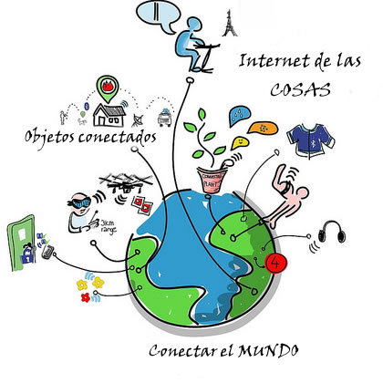

## [¿Qué es IOT?](https://es.wikipedia.org/wiki/Internet_de_las_cosas)

Hoy en día todos (bueno casi todos...) nuestros dispositivos están conectados entre sí:

* En nuestro televisor podemos ver todo tipo de contenidos
* Nuestro móvil nos acerca a cualquier parte del mundo incluso nos permite controlar muchos dispositivos:
  - El color de los leds de nuestro cuarto
  - El riego de la terraza
* Nuestra pulsera de actividad mide la cantidad de ejercicio que hacemos, lo envía a nuestro móvil que lo almacena y permite consultarlo en cualquier momento
* Miles de sensores miden la temperatura, humedad, presión atmosférica a lo largo de todo el mundo enviando los datos a centros donde estos se procesan. Junto con los satélites meteorológicos proporcionan toda la información necesaria para predecir el tiempo que tendremos mañana.

Todos estos sistemas/equipos actúan como dispositivos inteligentes conectados entre sí. Todos juntos forman lo que llamamos IOT o Internet de las cosas.

(De Drawed by Wilgengebroed on Flickr - Translated by Prades97, CC BY-SA 3.0, https://commons.wikimedia.org/w/index.php?curid=32745149)

Este divertido dibujo de Wilgengebroed nos puede servir para ver la cantidad de dispositivos 

Reflexión: ¿Qué dispositivos IOT conoces? ¿Cuáles utilizas?

# IOT y domótica

Vamos a pensar qué dispositivos te gustaría controlar remotamente, muchos de ellos forman parte de lo que llamamos **domótica**:

* Calefacción.
* Aire acondicionado.
* Encender la cocina para calentar la comida antes de que lleguemos a casa.
* ¿Estás seguro que se han apagado todas las luces de la casa al salir?.
* Una alarma que nos avise de si hay algún problema cuando no estamos en casa.
* Poder ver el estado de un familiar remotamente.
* Controlar el ejercicio que hace durante un día para así motivarte a hacer más.

## Características de los dispositivos IOT

Los dispositivos IOT suelen tener estas características:

* Bajo consumo o mejor autosuficiente (un panel solar y una batería). Si tiene una pulsera de actividad sabrá que es necesario cargarla una vez al mes.
* Conectividad con otros dispositivos como puede ser un teléfono móvil ya sea por medio de Bluetooth y /o WiFi.
* Medir algo: actividad, temperatura, consumo.
* Almacenar los datos, que se guardan hasta que se vuelve a sincronizar.
* Estos datos se suelen subir a páginas web (Thingspeak, Blynk, Adafruit, Cayenne, etc) donde se almacenan, y donde posteriormente podemos construir nuestros gráficos e informes.

## Ejemplos de sistemas IOT

Vamos a ver algunos sistemas/proyectos de IOT donde reconocemos sus características:

* Una estación meteorológica que recoge los datos de temperatura, humedad, lluvia y nos los muestra remotamente. Podremos consultar los datos anteriores.
* Pulsera para medir la actividad física.
  * Su batería dura unos ¡¡¡30 días!!!
  * Almacena sus datos (en local) y cuando puede se sincroniza (guardando datos en la nube).
  * Sólo proporciona información que luego vemos en otros dispositivos.
* Sistema de riego inteligente.
  * Un equipo (Arduino, micro:bit o similar) mide la humedad y decide si activar o no una bomba de agua.
  * Sistema de riego para una instalación de gran tamaño:
    * Cientos/miles de sensores de humedad.
    * Multitud de puntos de riego (válvulas/bombas).
    * Hacemos un datamining sobre los datos de humedad y se activan los puntos de riego.

## Proyectos

Veamos algunos de los proyectos en los que podríamos trabajar:

* Estación meteorológica: mediremos las magnitudes atmosféricas, mostrando los datos, guardándose y publicándose en internet para su posterior análisis.

* Medida de consumo y fomento de la eficiencia energética: mediremos el consumo de nuestro propio equipo y veremos cómo a medida que vamos incluyendo más componentes el consumo se hace mayor. Podríamos adaptar este sistema a un uso real dentro de la casa y viendo el consumo de los electrodomésticos.

* Control remoto de componentes: mediante el uso de un relé vamos a poder encender y apagar dispositivos remotamente con nuestro sistema bien por el cambio de alguna tela sistemas que medimos o bien por accionamiento externo.

* Medida de calidad del aire. Usaremos sensores de medida de partículas para determinar la calidad del aire y al mismo tiempo también mediremos el contenido en gases y los parámetros atmosféricos. Publicaremos todos estos datos en una página web para poder comparar la medida en diferentes lugares.
