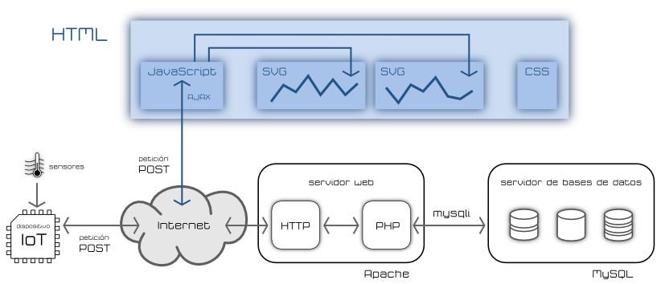

### Qué le pedimos al IOT

* Inteligencia:
    * [Niveles](http://www.domodesk.com/a-fondo-que-es-el-internet-de-las-cosas): identidad, ubicación, estado, contexto, criterio. Ejemplo: los cientos de sensores de humedad de una gran explotación. Un nivel más de Inteligencia sería incluir predicción (por ejemplo la atmosférica: si sabemos a que va llover, esperamos antes de regar).
* Arquitectura
  * [Protocolos](http://www.domodesk.com/a-fondo-que-es-el-internet-de-las-cosas): Cable, Wifi, Zigbee, bluetooth, GSM (y todas sus Gs), ...
  * M2M: Comunicación Machine To Machine.
    * Un drone recoge datos del nivel de suciedad de los paneles solares.
    * Envía los datos  a la central.
    * Cuando el nivel es el adecuado se activa el robot de limpieza en determinada zona.

## IOT con Raspberry

Dada la capacidad de procesamiento y la compatibilidad con todo tipo de sistemas, Raspberry Pi es ideal para ser el centro de las comunicaciones de un sistema IOT. Puede actuar como:

* Broker de comunicaciones, a donde se conectan todos los otros dispositivos.
* Base de datos para guardar los datos.
* Visualizador de datos usando aplicaciones específicas.
* Hacer  datamining (extracción de datos) sobre los datos almacenados.
* Publicar contenidos en forma de página web, canal de Telegram, etc

## ¿Cómo hacer un IOT?

¿Qué necesito?

[Arquitectura de un sistema completo IOT](https://polaridad.es/grafica-sensor-internet-de-las-cosas-iot/)

