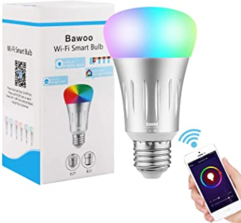
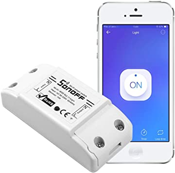
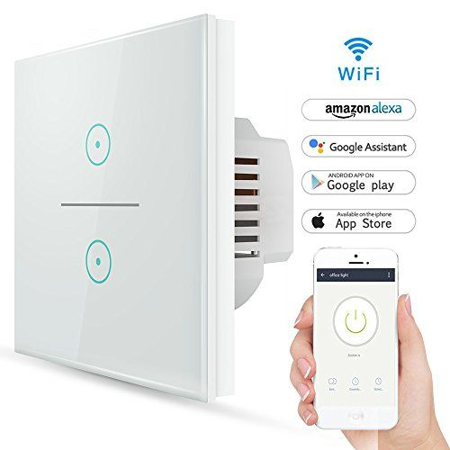
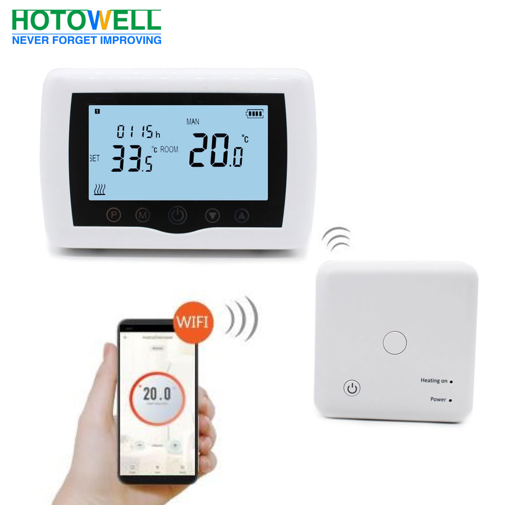
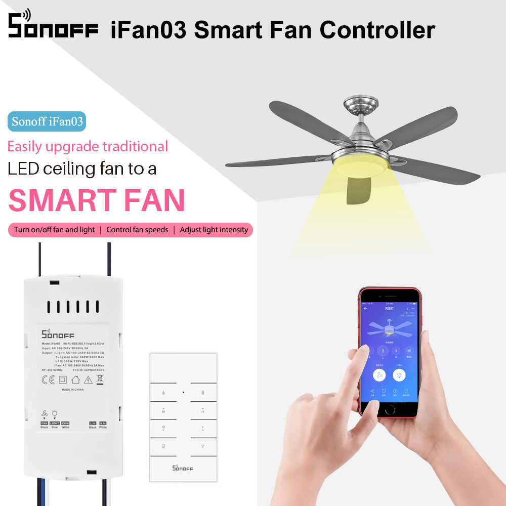
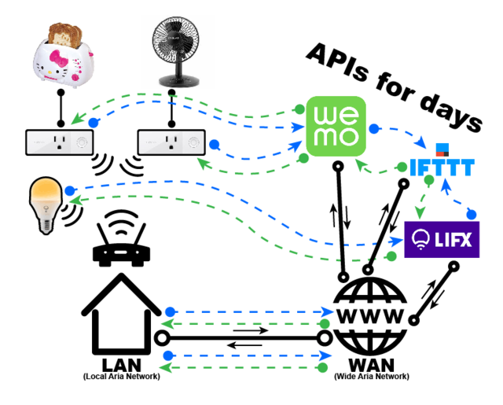

## Domótica

Llamamos domótica al conjunto de sistemas encargados de automatizar y controlar los equipos domésticos. Algunos serán sensores que detectarán el estado de la vivienda, otros controlarán los sistemas habituales en las casas como calefacción, ventilación,.. Todos ellos estarán integrados por medio de diferentes sistemas de comunicaciones e interaccionarán entre ellos según las reglas que establezca el usuario desde el sistema de control. 

Una vez tenemos una forma de comunicación entre sistemas sólo necesitamos ir integrando equipos de manera que interaccionen entre ellos y que  nosotros podamos controlarlos.

Cuando estos equipos los tenemos en casa decimos que tenemos una **instalación domótica**.

En este apartado voy a contar unos sencillos ejemplos que he utilizado en casa. Los he utilizado para aprender sobre el tema y hay que entender que son prototipos y pruebas de concepto pero que nos ayudan a entender el funcionamiento y las posibilidades de este tipo de sistemas.

En los siguientes capítulos veremos algunos ejemplos de sistemas más profesionales para trabajar la domótica

### Sistemas comerciales

Existen en el mercado multitud de elementos domóticos comerciales que podemos comprar por muy pocos euros:

* Bombillas que se activan con el móvil, incluso podemos cambiar el color de la luz que emite

* Relés genéricos para controlar el encendido por wifi 

* Enchufes que se controlan por wifi. . Con ellos podemos encender dispositivos no inteligentes como un ventilador o una lámpara
* Interruptores para controlar cualquier dispositivo. Al integrarlos en nuestro sistema domótico podemos controlar cualquier otro dispositivo sin necesidad de que esté conectados por cable.

* Termostatos inalámbricos que encenderán remotamente nuestro sistema de calefacción o el aire acondicionado según las reglas que hayamos configurado. 

* Sistemas para controlar el ventilador desde el móvil

(Todas las imágenes proceden de la documentación técnica que los fabricantes comparten)

Todos ellos utilizan una aplicación en nuestro móvil que tras emparejarlos nos permite controlar su funcionamiento. 

Al usar varios de ellos ya nos encontramos con un primer problema:

* Cada fabricante usa una aplicación diferente
* Incluso si tenemos equipos de un mismo fabricante pero comprados en diferentes fechas podemos tener que usar diferentes aplicaciones.

La mayoría de estas aplicaciones nos permiten hacer que unos equipos interaccionen con otros, pero siempre que sean del mismo fabricante.

Por otro lado, algo que nos queda oculto es que aunque estemos junto a nuestro equipo, en la gran mayoría de los casos, los datos viajan hasta los servidores del fabricante y nuestras acciones también han de hacerlo, con lo que nuestros datos y el uso de los distintos aparatos está moviéndose a través de internet. 

 Esto cuando menos debería de preocuparnos, por la posible falta de privacidad de nuestros datos y porque podría darse la circunstancia de que un fallo de comunicaciones o un error en los servidores del fabricante no nos permite usar nuestro equipo tenemos al lado.

Esta imagen de Adafruit refleja claramente el movimiento de nuestros datos:

Por todo ello vamos a ver en primer caso cómo hacer un sencillo sistema doméstico para entender su arquitectura.

En un segundo nivel veremos algunas distribuciones con un acabado más profesional como Home Assistant.

También veremos de pasada un ejemplo con Google Assistant para entender la complejidad y dónde están los problemas.

Para saber más puedes ver [la serie de vídeos sobre Domótica de Jorge Pascual](https://www.youtube.com/watch?v=IQLFgVg4TjM&list=PLFe_vhJmgS_51XlV_a5Atl1Re4fJA_b-d) son una excelente forma de aprender sobre este apasionante tema.

