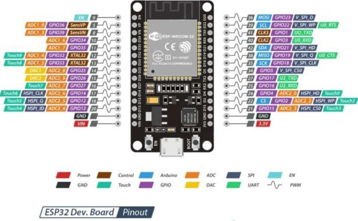

## Hardware para IOT

Existen multitud de dispositivos con las características necesarias para integrar nuestro proyecto en el mundo IOT.

Vamos a empezar trabajando con los equipos ESP32, del fabricante [Expressif](https://www.espressif.com/) que cumple todos los requisitos, a un precio muy interesante. Además podemos programarlo con heramientas de bloques (tipo scratch).

Existen muchas placas que utilizan el ESP32 adoptando distintos formatos, nosotros vamos a usar este [Wemos D1 ESP32 R32 wroom](https://solectroshop.com/es/modulos-wifi/1755-wemos-d1-esp32-r32-wroom-32-wifi-y-bluetooth.html) que adota el formato de las placas Arduino UNO:

Estás son las características de un ESP32:

* Alimentación: 5-12 V
* WiFi 802.11 b/g/n/e/i (802.11n hasta 150 Mbps)
* Bluetooth v4.2 BR/EDR y BLE.
* Compatible con escudos (shields) de Arduino Uno.
* 6 Entradas analógicas.
* 20 Entradas/Salidas digitales (3.3V) (con funciones PWM, interrupción).
* Comunicación UART, SPI, I2C.
* Tamaño: 68x53 mm
* Conexión micro USB.
* 4Mb de almacenamiento Flash (lo podemos usar para guardar nuestros datos)
* Memoria 520Kb
* Procesador Dual Core
* Reloj: 240Mhz 
* Temperatura de funcionamiento: -40C y 85C
* Corriente: 250mA (max)
* Corriente en modo ahorro: 0.15mA
* Corriente de funcionamiento: 20mA (sin WiFi) 

Estas son las patillas de nuestra placas

Esta es la correspondencia entre los nombres de las patillas de Arduino con el Wemos D1 R32:

(Cortesía de [Leopoldo Armesto Ángel](https://www.slideshare.net/LeopoldoArmestongel))

También usaremos ota versión del ESP32 que se conoce como Dev Kit con un empaquetado más compacto:

La funcionalidad es la misma, cambiando sólo la disposición de las patillas. Hay que tener en cuenta que algunos fabricantes usan algunas patillas para uso interno y no las tendremos accesibles externamente.

Por eso siempre debemos consultar la documentación del fabricante o distribuidor para ver el patillaje:

### Comparativa de prestaciones con Arduino/ESP8266/ESP32

En esta tabla podemos comparar las prestaciones del ESP32 con el clásico Arduino UNO y el ESP8266, una versión anterior del ESP32:

Vemos que cláramente el ESP32 bate en todos los puntos a Arduino, en algunas características, como el procesador o la memoria en un factor 200 o incluso 500.

