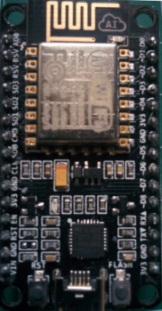

## Hardware

[Wemos D1 ESP32 R32 wroom](https://solectroshop.com/es/modulos-wifi/1755-wemos-d1-esp32-r32-wroom-32-wifi-y-bluetooth.html)

* Alimentación: 5-12VDC
* WiFi 802.11 b/g/n/e/i (802.11n hasta 150 Mbps)
* Bluetooth v4.2 BR/EDR y BLE.
* Compatible con shields de Arduino Uno.
* 6 Entrada analógica.
* 20 Entradas/Salidas digitales (3.3V) (con funciones PWM, interrupción).
* Comunicación UART, SPI, I2C.
* Tamaño: 68Ã--53 mm
* Conexión micro USB.
* 4Mb Flash Memoria 520Kb
* Reloj: 240Mhz (un núcleo dedicado al procesado de WiFi)
* Temperatura: -40C+85C
* Corriente: 250mA (max)
* Corriente en modo ahorro: 0.15mA
* Corriente de funcionamiento: 20mA (sin WiFi) 

### Arduino vs Wemos D1 R32

(Cortesía de [Leopoldo Armesto Ángel](https://www.slideshare.net/LeopoldoArmestongel))

### GPIO

* 18 Analog-to-Digital Conversores (ADC)
* 3 SPI interfaces
* 3 UART interfaces
* 2 I2C interfaces
* 16 PWM output channels
* 2 Digital-to-Analog Converters (DAC)
* 2 I2S interfaces
* 10 Capacitive sensing GPIOs

### Alternativas ESP32

#### M5Stack

#### Wemos

#### ESP8266-01

#### NodeMCU

#### [Wemos](https://github.com/javacasm/WeMos_ESP8266)

### Comparativa arduino/ESP8266/ESP32

