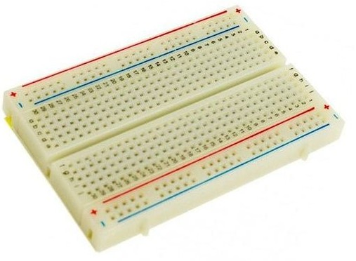
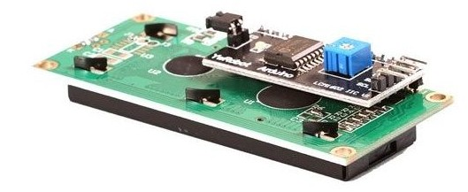
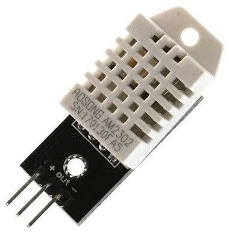
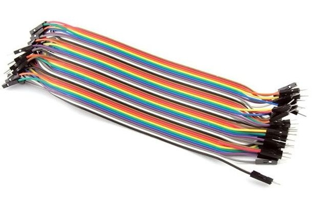
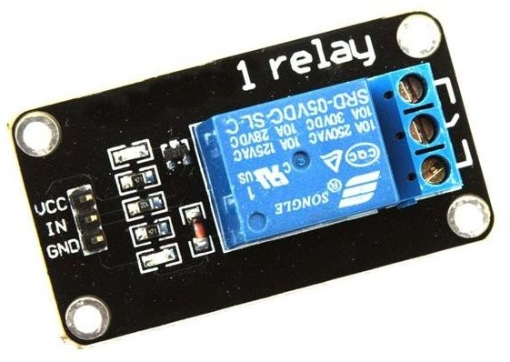
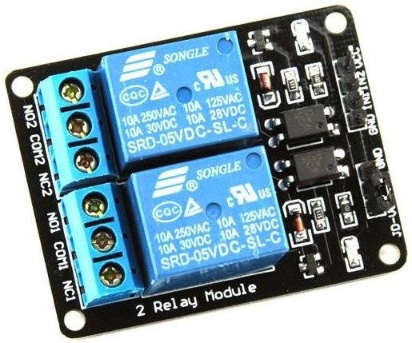
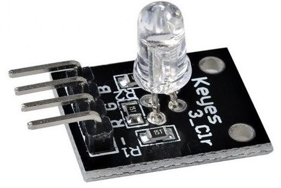
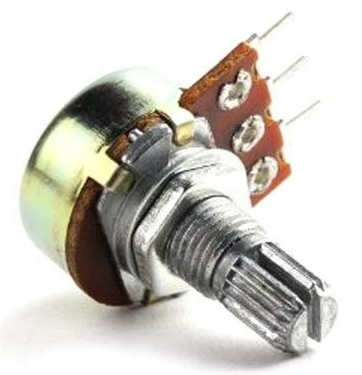

## Material electrónico

Es una minilista del material electrónico que usaremos en el curso, no es obligatorio.

Son materiales muy típicos y seguro que los tenéis en algún cajón y si tenéis otros similares los intentaremos usar también.

* Placa ESP32, preferiblemente la [WeMos D1 ESP32 R32 WROOM-32 WiFi y Bluetooth](https://solectroshop.com/es/modulos-wifi/1755-wemos-d1-esp32-r32-wroom-32-wifi-y-bluetooth.html)

* [Placa de prototipo protoboard, de tamaño medio](https://solectroshop.com/es/protoboard/256-placa-prototipo-protoboard-breadboard-400-puntos-arduino.html)

* [Pantalla LCD con conexión I2C](https://solectroshop.com/es/pantalla-lcd/285-pantalla-lcd-16x2-1602-azul-iic-i2c.html)

* [Sensor de humedad y temperatura DHT22](https://solectroshop.com/es/sensores-de-humedad/758-dht22-am2302-sensor-temperatura-humedad-pcb-cable-arduino-digital.html)  (o DHT11)

Cables de conexion [Macho-Macho](https://solectroshop.com/es/cables-planos-y-jumpers/1001-40x-cables-macho-macho-20cm.html)  [Macho-Hembra](https://solectroshop.com/es/cables-planos-y-jumpers/1000-40x-cables-hembra-macho-20cm.html)

* Al menos un [relé accionable con 5V](https://solectroshop.com/es/modulos-rele/390-modulo-rele-1-canal-5v-10a.html) o [relés](https://solectroshop.com/es/modulos-raspberry-pi-raspberry-pi-hats/883-modulo-rele-5v-10a-de-2-canales-para-arduino-pic-avr-dsp-raspberry-pi.html)

* Un par de leds con sus resistencias de 220Ohmios

* [Led RGB con sus resistencias de 220Ohmios ](https://solectroshop.com/es/modulos-arduino/1212-modulo-led-bombilla-rgb-color-completo-rgb-ky-016.html)

* [Potenciómetro de 10KOhmios](https://solectroshop.com/es/potenciometros/44-potenciometro-b10k-lineal.html) o similar

Otro sitio donde comprar material de excelente calidad es [bricogeek](https://tienda.bricogeek.com/)
