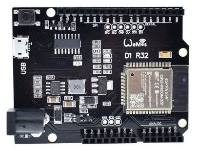

## Material electrónico para IOT

Es una minilista del material electrónico que usaremos en los montajes con ESP32, no es obligatorio y seguro que tienes algunos componentes similares y compatibles en tu cajón de cacharreo.

Para la placa ESP32 puedes elegir entre estas dos

* Placa ESP32  [WeMos D1 ESP32 R32 WROOM-32 WiFi y Bluetooth](https://solectroshop.com/es/modulos-wifi/1755-wemos-d1-esp32-r32-wroom-32-wifi-y-bluetooth.html)

* Placa [ESP32 Dev Kit](https://tienda.bricogeek.com/arduino-compatibles/1274-esp32-wroom-wifi-bluetooth.html)

Necesitarás el cable USB de datos para programar y alimentar la placa

* [Cable USB A  micro-usb](https://solectroshop.com/es/cables-usb/1439-cable-usb-a-a-micro-usb-b-arduino-leonardo-due.html)

* [Placa de prototipo protoboard, de tamaño medio](https://solectroshop.com/es/protoboard/256-placa-prototipo-protoboard-breadboard-400-puntos-arduino.html) para hacer los montajes

Sensores para medir distintas magnitudes, para trabajar con el ESP32 buscan que sean compatibles con 3V.

* [Sensor de humedad y temperatura DHT11](https://solectroshop.com/es/sensores-de-humedad/894-modulo-dht11-sensor-de-temperatura-y-humedad.html)

* [Sensor humedad de suelo](https://solectroshop.com/es/sensores-de-humedad/129-modulo-sensor-humedad-tierra-agua-suelo.html)

* [Sensor de agua o de nivel de líquido](https://solectroshop.com/es/sensores-de-nivel-de-fluido/853-modulo-sensor-nivel-de-agua-uno-mega-pic.html)

Para conectar todo necesitaremos cables, que dependiendo de las conexiones de nuestra placa tendrán que ser M-H, M-M o H-H

* Cables de conexión [Macho-Macho](https://solectroshop.com/es/cables-planos-y-jumpers/1001-40x-cables-macho-macho-20cm.html)  [Macho-Hembra](https://solectroshop.com/es/cables-planos-y-jumpers/1000-40x-cables-hembra-macho-20cm.html)

Si queremos controlar equipos externos, lo mejor para empezar es un relé, lo encontraremos en diferentes empaquetados según el número de equipos que queramos controlar:

* Al menos un [relé accionable con 5V](https://solectroshop.com/es/modulos-rele/390-modulo-rele-1-canal-5v-10a.html) o [relés](https://solectroshop.com/es/modulos-raspberry-pi-raspberry-pi-hats/883-modulo-rele-5v-10a-de-2-canales-para-arduino-pic-avr-dsp-raspberry-pi.html)

* Un par de leds con sus resistencias de 220 Ohmios

Otros elementos interesantes:

* [Pantalla LCD con conexión I2C](https://solectroshop.com/es/pantalla-lcd/285-pantalla-lcd-16x2-1602-azul-iic-i2c.html)

* [Sensor de humedad y temperatura DHT22](https://solectroshop.com/es/sensores-de-humedad/758-dht22-am2302-sensor-temperatura-humedad-pcb-cable-arduino-digital.html) más preciso que el DHT11

* [Potenciómetro de 10 KOhmios](https://solectroshop.com/es/potenciometros/44-potenciometro-b10k-lineal.html) o similar para regular parámetros

Otro sitio donde comprar material de excelente calidad es [bricogeek](https://tienda.bricogeek.com/)

