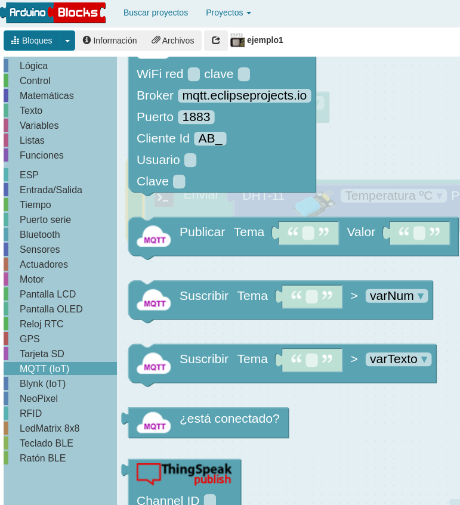
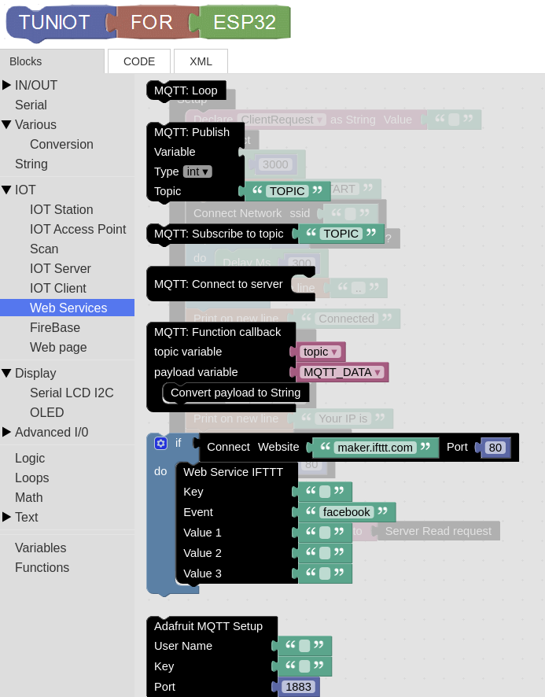

# Programación con bloques

Vamos a ver algunas alternativas para poder programar aplicaciones IOT usando bloques en herramientas gráficas

## [ArduinoBlocks](http://www.arduinoblocks.com)

ArduinoBlocks es una herramienta gráfica que permite crear proyectos para diferentes placas de arduino, ESP8266 y ESP32 utilizando su página web. 

Dispone de bloques para controlar y programar muchos sensores, actuadores y también para crear aplicaciones IOT de una forma muy sencilla

Una vez creado el programa con bloques podemos ver el código equivalente o si instalamos [el complemento abconnector](http://www.arduinoblocks.com/web/site/abconnector5) en nuestro ordenador, podemos enviar el ejecutable a nuestra placa que tenemos que conectar por USB.

Para compilar el código generado en el IDE de Arduino tenemos que instalar las [librerías necesarias](http://www.arduinoblocks.com/web/help/libraries)

## [Tuniot](http://easycoding.tn/esp32/demos/code/)

Tuniot es una estupenda herramienta creada por el profesor Adel Kassah que nos permite crear programas para [Arduino](http://easycoding.tn/bde/demos/code/?lang=es), [ESP8266](http://easycoding.tn/tuniot/demos/code/) y [ESP32](http://easycoding.tn/esp32/demos/code/)) desde su página web.

Una vez creado el programa con los bloques, descargarmos el código y lo enviamos a la placa usando el IDE de Arduino. Para ello necesitamos usar [sus librerías](http://easycoding.tn/index.php/resources/)

## [MasayloBlocky](https://clubroboticagranada.github.io/MASAYLO-CRG/masayloBlockly/descarga/)

MasayloBlockly es una herramienta gráfica que podemos descargar e instalar (también usar online) para generar programar con bloques. Está creada por Antonio Gómez y permite programar Arduino, ESP8266 y ESP32

