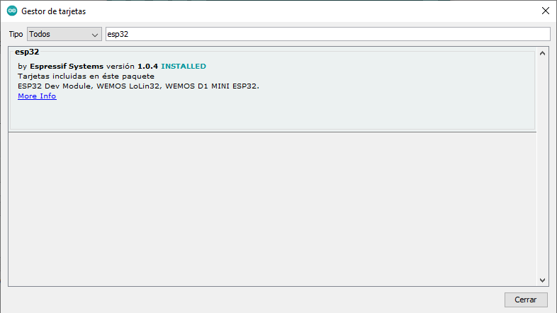

### Instalación SDK ESP32 en IDE Arduino

Para poder programar placas con ESP32 desde el IDE de Arduino hemos de añadir un complemento (que incluye las librerías y el compilador adecuado para la placa)

1. Añadimos el repositorio de placas ESP32 en preferencias: "Archivo" -> "Preferencias" y añadimos esta URL (si ya hay ponemos una "," para separar) :

[https://dl.espressif.com/dl/package_esp32_index.json](https://dl.espressif.com/dl/package_esp32_index.json)


2. Añadimos las placas desde el menú "Herramientas" -> "Placas" -> "Gestor de tarjetas..." y buscamos "ESP32"



3. Pulsamos "Instalar"

4. Ahora tendremos nuevas placas disponibles. Seleccionaremos "ESP32 Dev Module" o "Do32..." según el fabricante

5. Si usamos SO Windows, tendremos que instalar los drivers para el chip CH340

6. También nos aparecerán nuevos ejemplos

### Drivers para Windows

[Driver windows ch341ser](./ch341ser_win.zip)

### Problemas en linux


El SDK del ESP32 necesita tener instalado python (a día de hoy python2)

Si no podemos descargar, revisaremos que el usuario pertenezca al grupo **dialout**

```sh
sudo adduser $USER dialout
`` 


