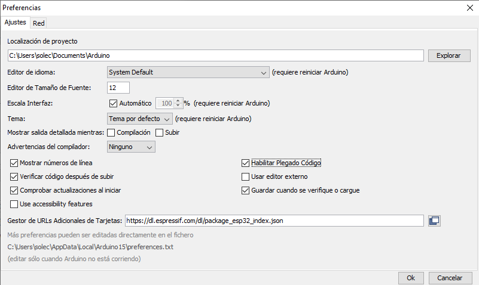
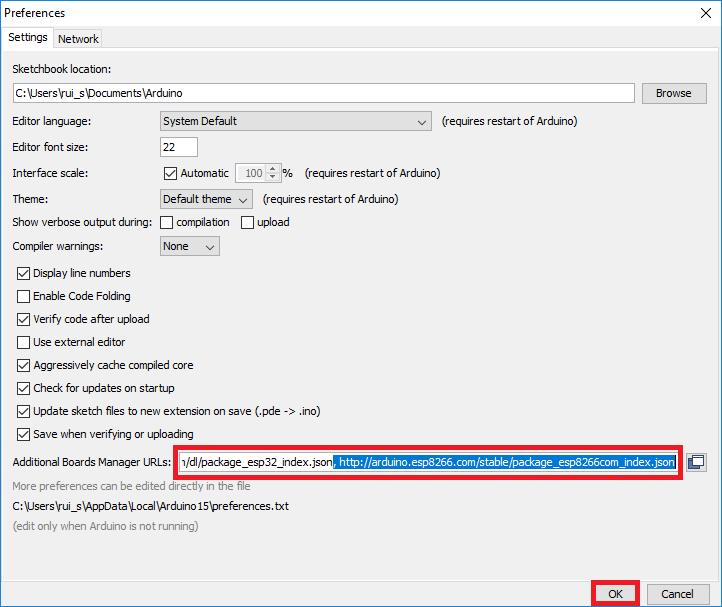

### Instalación SDK ESP8266 en IDE Arduino

Para poder programar placas con ESP8266 desde el IDE de Arduino hemos de añadir un complemento (que incluye las librerías y el compilador adecuado para la placa)

1. Añadimos el repositorio de placas ESP32 en preferencias: "Archivo" -> "Preferencias" y añadimos esta URL (si ya hay ponemos una "," para separar) :

[http://arduino.esp8266.com/stable/package_esp8266com_index.json](http://arduino.esp8266.com/stable/package_esp8266com_index.json)



2. Añadimos las placas desde el menú "Herramientas" -> "Placas" -> "Gestor de tarjetas..." y buscamos "ESP8266"



3. Pulsamos "Instalar"

4. Ahora tendremos nuevas placas disponibles. Seleccionaremos "NodeMCU" según el fabricante

5. Si usamos SO Windows, tendremos que instalar los drivers para el chip que incluya nuestra placa

6. También nos aparecerán nuevos ejemplos


### Problemas en linux

Si no podemos descargar, revisaremos que el usuario pertenezca al grupo **dialout**

```sh
sudo adduser $USER dialout
`` 


