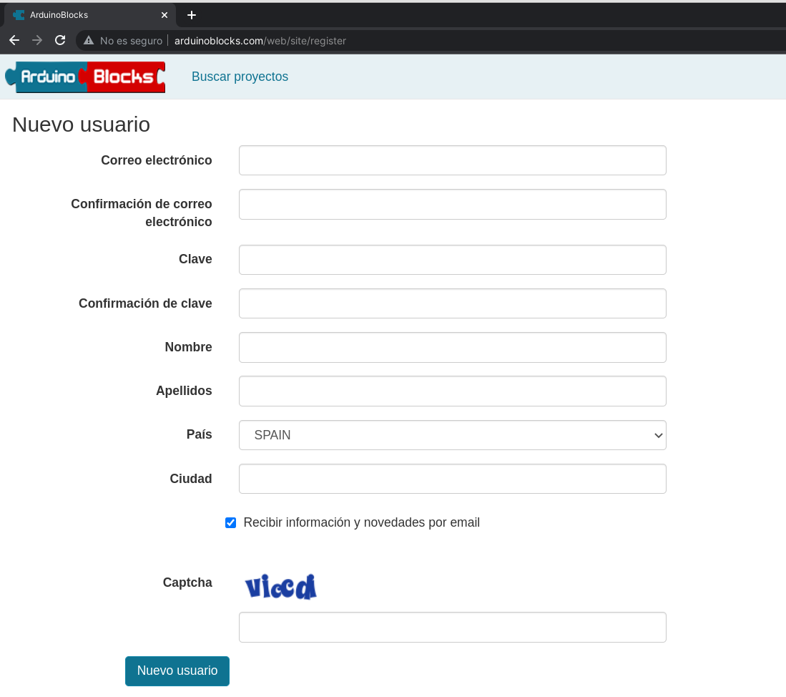

# Instalación de ArduinoBlocks

Comenzaremos usando [ArduinoBlocks.com](http://www.arduinoblocks.com): una herramienta de programación con bloques ideal para iniciarse.

Instalamos [ArduinoBlock Connector](http://www.arduinoblocks.com/web/site/abconnector5)

* En EducaAndOS está en el repositorio
* En otros sistemas, lo descargamos  e instalamos
* Funciona perfectamente en Windows 10 si está actualizado, en Windows 7 hay que instalar algunas actualizaciones.

En ubuntu:

```sh
sudo dpkg -i abconnector.deb
```


[Creamos nuestra cuenta](http://www.arduinoblocks.com/web/site/register)



En algunas distribuciones de linux necesitamos que por defecto se use python3, por lo que tenemos que hacer

```sh
sudo apt remove python-is-python2

sudo apt install python-is-python3
```

Y si es necesario instalamos py-serial, bien descargándolo de arduinoblocks.com o bien con

```sh
sudo apt install python3-serial
```

Para probar que funciona arrancamos ArduinoBlock connector, conectamos la placa y nos debe aparecer el puerto arriba a la derecha


En Windows, si no nos detecta la placa, desde el **Administrador de Archivos**, en puertos de comunicaciones, seleccionamos la placa y pulsamos en **Actualizar controlador**

Si no lo encuentra, podéis descargar [este paquete](https://github.com/javacasm/CursoIOTCo/raw/main/ch341ser_win.zip) e instalarlo, pero es de una versión anterior.


