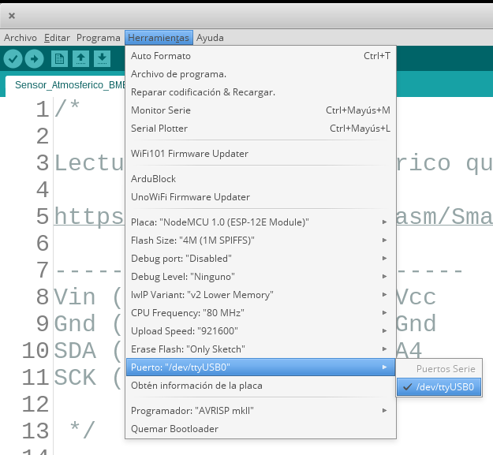

## Encendiendo Leds

Vamos a empezar usando el led que incluye la placa, haciéndolo parpadear.

#### Desde ArduinoBlocks

Creamos un programa con los bloques que hemos visto [Parpadeo Led interno](http://www.arduinoblocks.com/web/project/791181)

* En la parte de Inicializar incluímos la configuración del puerto de conexión con el PC

Si echas en falta la configuración del pin digital es porque ArduinoBlocks se encarga de ello automáticamente.

En el bucle:

* Activamos el Pin digital 2 (donde está conectado el led incluído en la placa)
* Enviamos el mensaje "On" al PC
* Esperamos medio segundo
* Apagamos el Pin digital 2 
* Enviamos el mensaje "Off" al PC
* Esperamos medio segundo

Puedes ver el código generado pulsando en el desplegable "Bloques" y seleccionando Código.

Ahora conectamos la placa, y arrancamos **ArduinoBlocks Connector**, veremos el puerto serie al que está conectada la placa y se activará el botón de **Subir** que pulsaremos:

Una vez terminada la subida nos muestra que todo ha ido bien y el tamaño del programa generado

Activamos la **consola**, seleccionamos la velocidad adecuada (la que pusimos en el bloque configuración) y pulsamos "Conectar"

#### Desde código con el IDE 

Para ello cargaremos el ejemplo Blink del IDE

**Archivo -> Ejemplos -> 01.Basics -> Blink**

Vemos que ahora se utiliza una constante **LED_BUILTIN** que es diferente en cada placa (13 en Arduino, 2 en el Wemos D1 ESP32, ...)

##  Uso del IDE

Si eres más de usar código, puedes hacer un programa similar desde un ejemplo del IDE de Arduino:

1. Cargamos un ejemplo Archivo -> Ejemplos
2. Seleccionamos (o comprobamos que está seleccionada) la placa  "ESP32 Dev Kit" en Herramientas -> Placa -> Placa
3. Seleccionamos el puerto al que está conectado Herramientas -> Puerto -> ttyUSB

  

4. Seleccionamos Herramientas -> Velocidad de transmisión -> 921600

    

5. Subimos el programa a la placa, El led rojo/azul de la placa parpadeará

  Se puede producir un error si no hemos seleccionado bien el puerto USB en el paso anterior

  

6. Una vez subido empezará a parpadear un led azul de la placa

## Placa de prototipo

Es como una regleta de conexiones

Los agujeros conectados por líneas en el esquema están conectados eléctricamente

Vamos a conectar un **led externo**

## Ejercicios:

1. Vamos a conectar un led externo (con su correspondiente resistencia)
1. Añadir un segundo led externo con su correspondiente resistencia conectado a otro pin y haz que parpadeen a destiempo
1. Hacer diferentes secuencias de encendido con los diferentes leds

