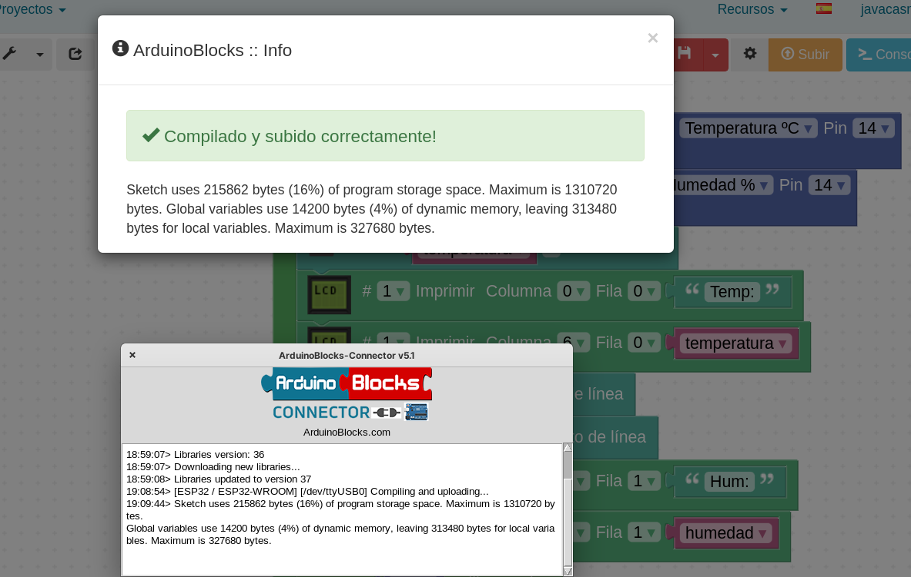
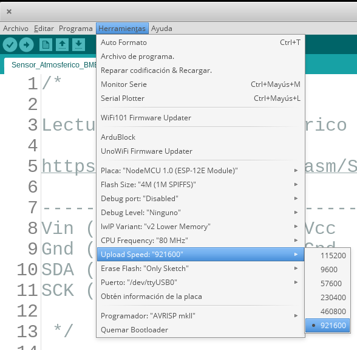
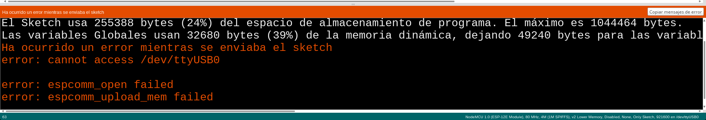
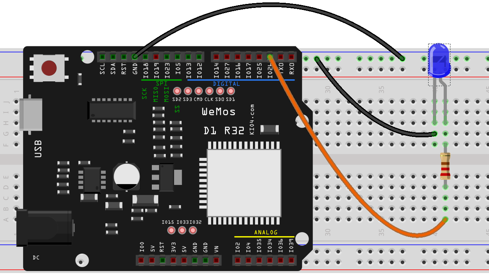

## Leds

Vamos a empezar usando los leds que incluye la placa.

### Blink o parpadeo


#### Desde ArduinoBlocks


[Parpadeo Led interno](http://www.arduinoblocks.com/web/project/791181)


Ahora conectamos la placa, y arrancamos **ArduinoBlocks Connector**, veremos el puerto de la placa y se activará el botón de **Subir**


Una vez terminado nos muestra que todo ha ido bien y el tamaño del programa generado



Activamos la **consola**, seleccionamos la velocidad adecuada (la que pusimos en el bloque configuración) y pulsamos "Conectar"


#### Desde código con el IDE 

Para ello cargaremos el ejemplo Blink del IDE

**Archivo -> Ejemplos -> 01.Basics -> Blink**

Vemos que ahora se utiliza una constante **LED_BUILTIN** que es diferente en cada placa (13 en Arduino, 2 en el Wemos D1 ESP32, ...)

##  Uso del IDE

1. Cargamos un ejemplo Archivo -> Ejemplos
1. Seleccionamos (o comprobamos) que está seleccionada la placa NodeMCU para ESP8266 o "ESP32 Dev Kit" en Herramientas -> Placa -> Placa


1. Seleccionamos el puerto al que está conectado Herramientas -> Puerto -> ttyUSB

  

1. Seleccionamos Herramientas -> Velocidad de transmisión -> 921600

    

1. Subimos el programa a la placa, El led ázul de la placa parpadeará

  Se puede producir un error si no hemos seleccionado bien el puerto USB en el paso anterior

  

1. Una vez subido empezará a parpadear un led azul de la placa

## Ejercicios:

### Haciendo parpadear 2 leds


Vamos a conectar un led externo (con su correspondiente resistencia)

### ¿Cómo podemos localizar el pin del led?

* Haciendo un bucle que itere entre todos los pines ([Código](https://github.com/javacasm/CursoIOTCo/blob/main/codigo/3.2.1.BuscandoLED_BUILTIN/3.2.1.BuscandoLED_BUILTIN.ino))

```C++
 while(pin < 32){
  pinMode(pin,OUTPUT);
  digitalWrite(pin,HIGH);
  Serial.print("Enciendo el led ");
  Serial.println(pin);
  delay(5000);
  digitalWrite(pin,LOW);
  delay(5000);
  pin = pin + 1;
 }
```
  Comentar: 
  * Cuidado con usar pinMode en setup()
  * Cuidado con variables globales

* Mostrando vía serial el valor de LED_BUILTIN
```C++
  Serial.print("Enciendo el led ");
  Serial.println(LED_BUILTIN);
```

### Más Ejercicios

1. Añadir un segundo led externo con su correspondiente resistencia conectado a otro pin y haz que parpeen a destiempo
1. Hacer diferentes secuencias de encendido con los diferentes leds


## Placa de prototipo

Es como una regleta de conexiones


Vamos a conectar un **led externo**

