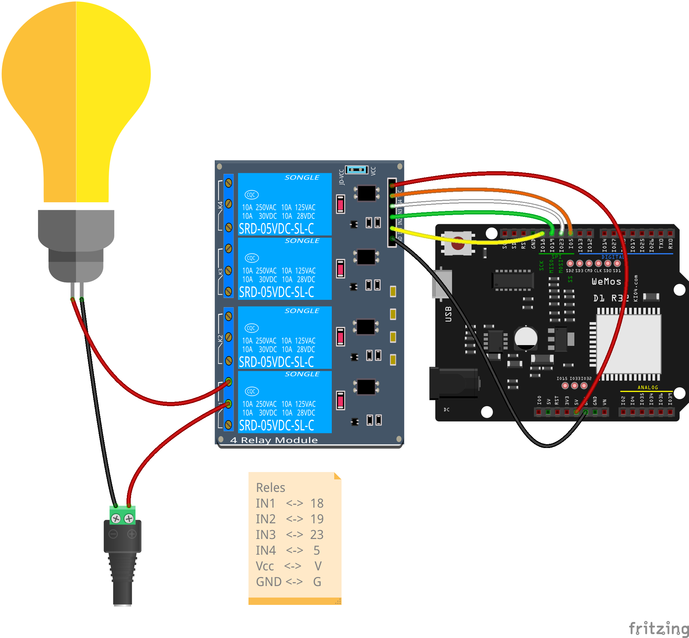

## Relés

1. ¿Qué es un relé? un interruptor eléctrico que podemos accionar electrónicamente con una pequeña corriente y que funciona casi siempre electromecánicamente (un electroimán que atrae un contacto eléctrico) de ahí el 'clic-clic' que hacen al funcionar. También existen relés digitales 100% que no incluyen partes mecánicas

1. Uso:  control de dispositivos que necesitan más potencia y/o que funcionan a mayores voltajes
1. Control: para activar/desactivar los relés sólo tenemos que activar/desactivar el pin al que está conectado
1. Alimentación y Consumo: el control de relés requiere de una mayor potencia de la que puede suministrar el puerto USB, por lo que usaremos un transformador si es posible
1. Puesto que las señales de control de la  placa son de 3.3V pudiera ser que algunos relés no se activen correctamente.

### Montaje

Conectaremos la alimentación del relé a 5V

En el ejemplo del relé, podemos poner la alimentación desde un enchufe o desde cualquier otra fuente de alimentación. Los relés funcionan como un interruptor eléctrico po tanto pueden conducir cualquier tipo de corriente, alterna o continua, siempre que esté dentro de su características (el del esquema puede usar hasta 250V y 10A).

### Ejemplo industrial

[Sonoff](
https://programarfacil.com/esp8266/domotica-sonoff-wifi-espurna/)

