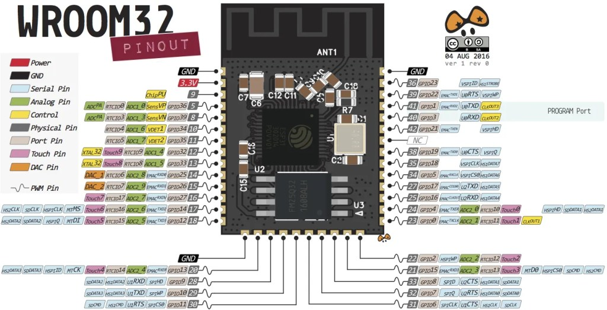
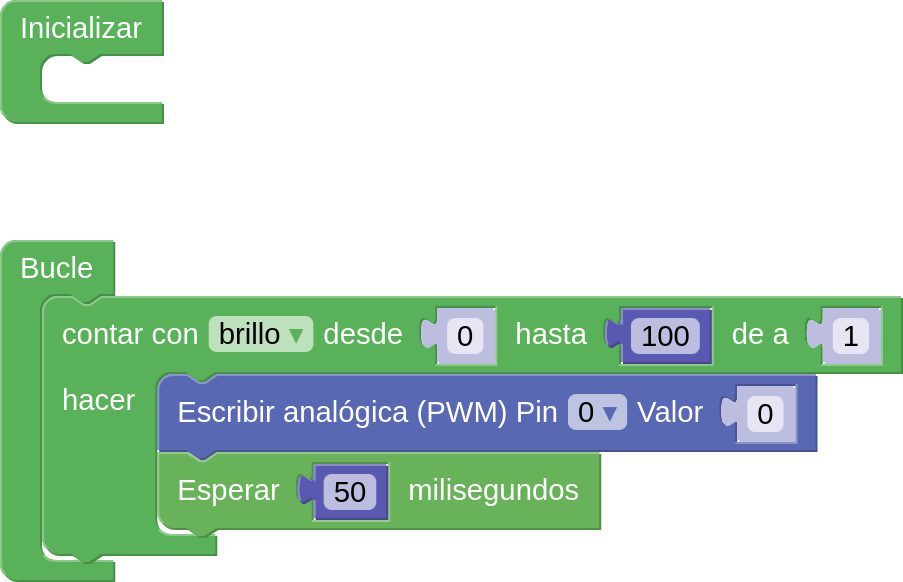
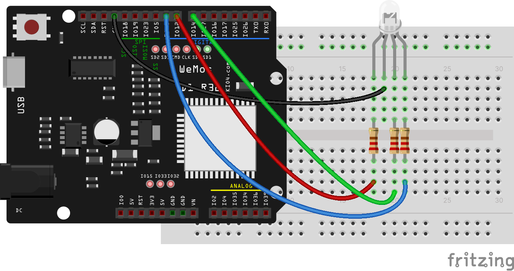

# Iluminación gradual con PWM

Vamos a controlar la intensidad de iluminación usando una técnica que se llama PWM


Hacemos el cambio de esta 1000 veces por segundo (Frecuencia PWM)
Cuanto mayor sea el % de tiempo que la señal esté en estado algo mayor será la potencia que se trasmite. Es lo que se conoce como el ciclo de carga (Duty cicle)


Podemos usar cualquiera de estos pines para generar una señal PWM (18 Analog-to-Digital Converter (ADC) channels)



### ArduinoBlocks

[Test de PWM](http://www.arduinoblocks.com/web/project/791193)




### Código Arduino

En las placas Arduino y ESP8266, podemos establecer el nivel PWM con la instrucción __analogWrite__

```C++
    analogWrite(D6,valorPWM);
```

Siendo 1023 el valor para 100% y 0 para 0%


Con esta técnica podemos controlar la potencia que se transmite a un led o a un motor, pero no a un relé (porque el relé no es capaz de encenderse tantas veces por segundo)

También podemos cambiar la frecuencia del PWM usando __analogWriteFreq__ pudiendo ser esta desde 1Hz hasta 1000KHz

En el ESP32, tenemos más libertad para hacerlo:

* Podemos configurar hasta 16 canales PWM distintos, cada uno con su frecuencia (entre 1 y 10KHz), resolución (entre 1 y 16 bits)
   ```C++
   ledcSetup(canal, frecuencia, resolucion);
   ```
* Conectamos el pin  que queremos usar a un canal ya configurado (podemos usar cualquiera de ellos salvo los GPIOs 34 a 39)
   ```C++
   ledcAttachPin(pin, canal);
   ```
* Definiemos el nivel de carga (duty level), que vendrá limitado por la resolución que hemos utilizado
   ```C++
   ledcWrite(canal,nivel);
   ```


## Montaje

Igual que otro led externo:


## Código


```C++
// the number of the LED pin
const int ledPin = 2;  // GPIO02 es el Led de la placa


// Coniguración del PWM
const int freq = 5000;
const int ledChannel = 0;
const int resolution = 8;
 
void setup(){
  // configuramos el canal PWM 
  ledcSetup(ledChannel, freq, resolution);
  
  // Conectamos el canal al pin del LED
  ledcAttachPin(ledPin, ledChannel);
}
 
void loop(){
  // Aumentamos el brillo
  for(int dutyCycle = 0; dutyCycle <= 255; dutyCycle++){   
    ledcWrite(ledChannel, dutyCycle);
    delay(2);
  }

  // disminiumos el brillo
  for(int dutyCycle = 255; dutyCycle >= 0; dutyCycle--){
    ledcWrite(ledChannel, dutyCycle);   
    delay(2);
  }
}

```

Esto nos permite, por ejemplo hacer que varios leds usen un mismo canal, sin más que conectar todos los pines al mismo canal
```C++
  ledcAttachPin(ledPin1, canal);
  ledcAttachPin(ledPin2, canal);
  ledcAttachPin(ledPin3, canal);
```

### Led RGB

Son 3 leds de colores Rojo, Azul y Verde en un único encapsulado, con una de las patillas conectadas, en nuestro caso es el pin negativo. Conectamos unas resistencias en serie para limitar la cantidad de corriente y el voltaje que llega al led.





Podemos crear colores combinando el brillo de cada uno


[Programa led RGB](http://www.arduinoblocks.com/web/project/791469)


Para controlar mejor el color del led vamos a crear una función, que es una manera de reutilizar nuestro código muchas veces de manera sencilla


[Proyecto: led RGB con función](http://www.arduinoblocks.com/web/project/782650)
