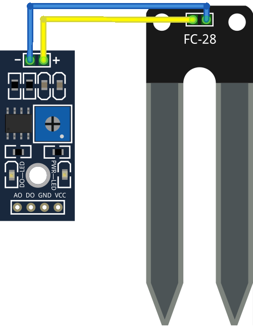

# Sensores analógicos

Los **sensores digitales** son aquellos que sólo pueden medir dos valores: 0 ó 1, encendido o apagado, On u Off, TRUE o FALSE

Los **sensores analógicos** son aquellos capaces de medir valor continuos, en un rango de posibles medidas, transformando el valor de una magnitud física en un medida eléctrica, en concreto en un voltaje

En el mundo Arduino (y en el ESP) por sencillez esa medida se transforma en un valor entero, que dependiendo del número de bits que usemos estará entre 0 y 1023, si usamos 10 bits (como en Arduino o en el ESP) o entre 0 y 4095 en el ESP32 donde usamos 12 bits.

Arduino mide entre 0 y 5V, mientras que ESP y ESP32 lo hace entre 0 y 3.3V

Para medir las magnitudes conectaremos el dispositivo a medir a una de las patillas analógicas: 


    ADC1_CH0 (GPIO 36)
    ADC1_CH1 (GPIO 37)
    ADC1_CH2 (GPIO 38)
    ADC1_CH3 (GPIO 39)
    ADC1_CH4 (GPIO 32)
    ADC1_CH5 (GPIO 33)
    ADC1_CH6 (GPIO 34)
    ADC1_CH7 (GPIO 35)
    ADC2_CH0 (GPIO 4)
    ADC2_CH1 (GPIO 0)
    ADC2_CH2 (GPIO 2)
    ADC2_CH3 (GPIO 15)
    ADC2_CH4 (GPIO 13)
    ADC2_CH5 (GPIO 12)
    ADC2_CH6 (GPIO 14)
    ADC2_CH7 (GPIO 27)
    ADC2_CH8 (GPIO 25)
    ADC2_CH9 (GPIO 26)


Desgraciadamente la lectura en el ESP32 no es perfecta, y tienen problemas al medir voltajes muy pequeños y cuando mide cerca de 3.3


## ArduinoBlocks

Vamos a controlar el brillo de un led con un potenciómetro


[Programa de control de brillo del led con potenciómetro](http://www.arduinoblocks.com/web/project/783698)


## Código Arduino

Para leer el valor analógico sólo tenemos que hacer:
```C++
int valor =  analogRead(pin);
```

Además podemos ajustar la forma de la medida con las siguientes funciones (y otras más...):

* __analogReadResolution(resolution)__: establece el número de bits o resolución. puede estar entre 9 (va lores entre 0 y 511) y 12 bits (0 – 4095). Por defecto es  12 bits.
* __analogSetAttenuation(atenución)__: Establece la atenuación (valor máximo que se puede medir) para todos los pines ADC. Por defecto es ADC_11db y puede ser:
    * ADC_0db: sin atenuación,  valor máximo 800 mV
    * ADC_2_5db: valor máximo 1100 mV
    * ADC_6db: podemos medir hasta 1350 mV
    * ADC_11db: Permite medir hasta  2600 mV

## Sensor magnético

El ESP32 incluye un sensor de efecto Hall entre su hardware, lo que nos permite medir el campo magnético.

Es un sensor que nos da un valor con signo de la intensidad de campo magnético

```C++

void setup() {
  Serial.begin(115200);
}

void loop() {
  
  int campoMagnetico = hallRead();
  Serial.println(campoMagnetico); 
  delay(100);
}
```


# Tipos de sensores

Algunos sensores analógicos:

* Sensor de luz
* Sensor de humedad de suelo




