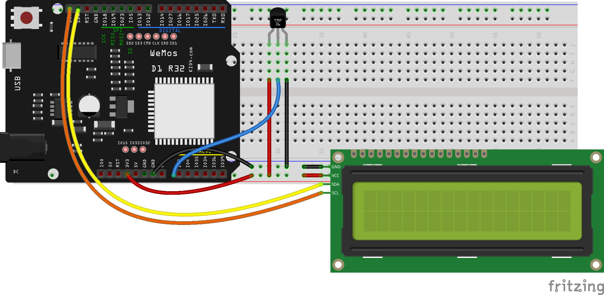
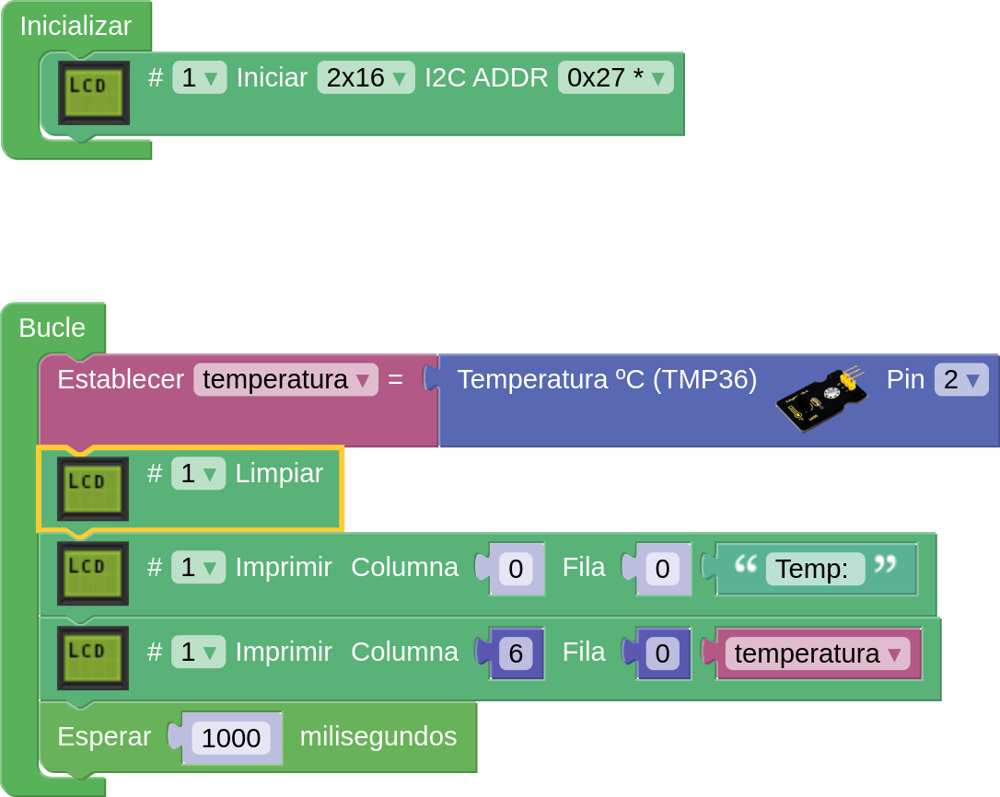
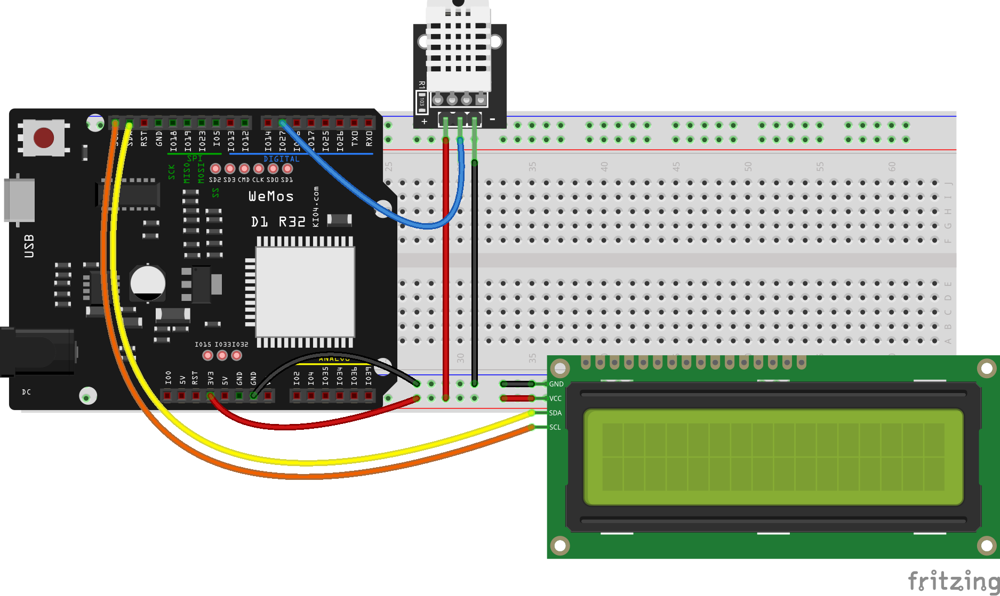
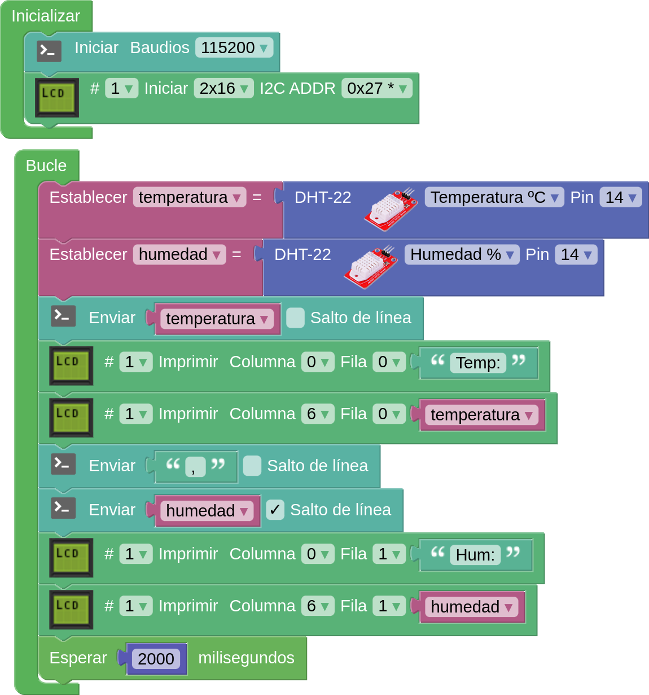

## Sensores atmosfericos

Son sensores capaces de medir los valores de las magnitudes atmosféricas, como la temperatura, humedad, presión, etc.

Veremos los distintos tipos y mostraremos los resultados por el monitor serie y en una pantalla LCD

Si no se ven los valores en el LCD puede ser por un error de conexión del sensor. Abriremos el monitor serie para ver si hay errores del sensor.


### TMP36

Es un sensor de temperatura muy utilizado que nos da una resolución de 0.5 grados y con un formato muy compacto similar a un transistor. Su conexión es muy sencilla: conectamos los pines de alimentación a 3V y GND y la patilla de salida a un pin analógico, del que sólo tenemos que leer el valor analógico de su salida.




[TMP36 - LCD en Wemos D1 R32](http://www.arduinoblocks.com/web/project/791472)




#### Código Arduino

El código Arduino es bastante sencillo también. Sólo tenemos que leer el valor analógico del pin analógico al que lo hemos conectado y convertir la lectura a grados usando la expresión:

```C++
grados = (analógico/1023.0 - 0.5) * 100
```

El programa quedaría así [Código](https://github.com/javacasm/CursoIOTCo/blob/main/codigo/3.6.1.TMP36/3.6.1.TMP36.ino):

```C++
const int tempPin = 2;     //analog input pin constant<br>
int tempVal;    // temperature sensor raw readings
float volts;    // variable for storing voltage 
float temp;     // actual temperature variable
void setup()
{
  // start the serial port at 9600 baud
  Serial.begin(9600);
}
void loop()
{
 //read the temp sensor and store it in tempVal
 tempVal = analogRead(tempPin);
 volts = tempVal/1023.0;             // normalize by the maximum temperature raw reading range
 temp = (volts - 0.5) * 100 ;         //calculate temperature celsius from voltage as per the equation found on the sensor spec sheet.
Serial.print(" Temperature is:   "); // print out the following string to the serial monitor
Serial.print(temp);                  // in the same line print the temperature
Serial.println (" degrees C");       // still in the same line print degrees C, then go to next line.
delay(1000);                         // wait for 1 second or 1000 milliseconds before taking the next reading. 
}
```


Ejercicio: [Mostrar el valor del sensor en la pantalla LCD](https://github.com/javacasm/CursoIOTCo/blob/main/codigo/3.6.2.LCD_temperatura/3.6.2.LCD_temperatura.ino)

### DHT

Los DHT son una familia de sensores muy baratos que miden la temperatura y humedad ambiental. El DHT22 (blanco) tiene una precisión de 0.5 grados y el DHT11  (azul) entre 1 y 2 grados. Debemos dar tiempo al sensor a realizar la medida, por ello debemos espear 1 o 2 segundos entre medidas. Si no le damos tiempo podemos obtener errores en la medida, en forma de valor Nan (Not a number)

Para conectarlos necesitamos un pin digital para cada sensor.



### ArduinoBlocks

Leeremos el valor de la temperatura y el de la humedad por separado con 2 bloques del tipo de sensor usado usando bloques del LCD para mostrar los valores en la pantalla y enviándolos al PC

[Programa DHT + LCD](http://www.arduinoblocks.com/web/project/791195)


