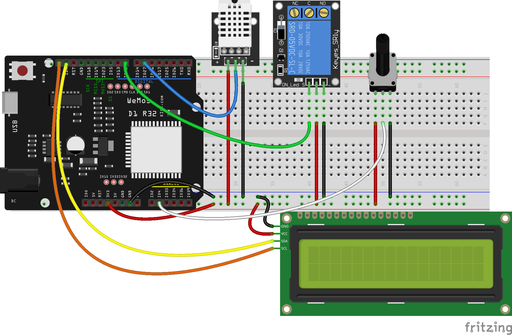

## Termostato

Un termostato es un dispositivo que se activa o no dependiendo del valor de la temperatura que mide.

Usaremos un sensor digital DHT22 para medir, un potenciómetro para ajustar el valor umbral, un relé y un LCD para mostrar temperatura, umbral y el estado del relé.

En un sistema real el relé activaría o desactivaría el dispositivo de calefacción

En el montaje vemos que hemos conectado todos los componentes a los hilos de alimentación 3V y GND y cada componente a un pin concreto.

El programa hace:

* Lee los valores de los sensores y del potenciómetro y los guardamos en variables. El valor del potenciómetro lo convertimos al rango 15-30 que es donde esperamos que esté la temperatura
* Mostramos los valores en la pantalla y en el PC
* Comparamos la temperatura leída con el valor del potenciómetro:
    - Si es menor activamos el relé
    - Si es mayor desactivamos el relé

[Programa Termostato - ESP32](http://www.arduinoblocks.com/web/project/791492)

