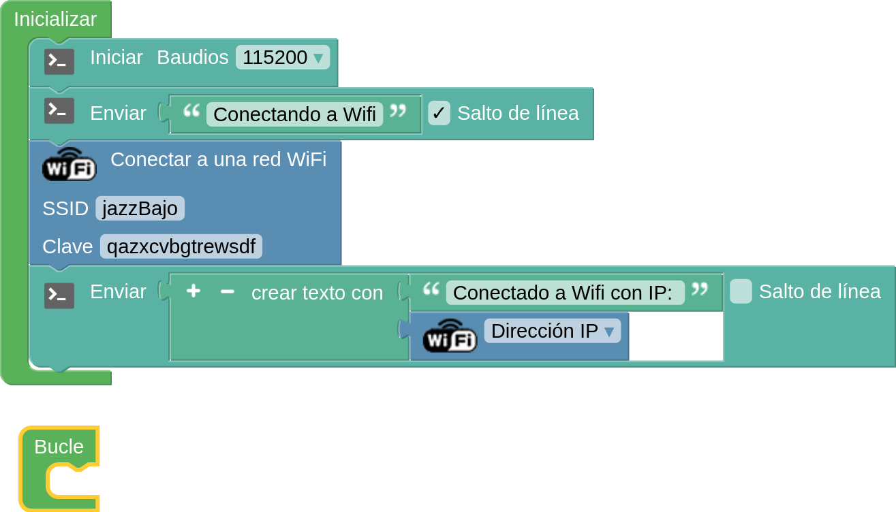
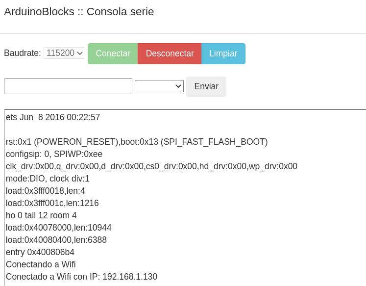
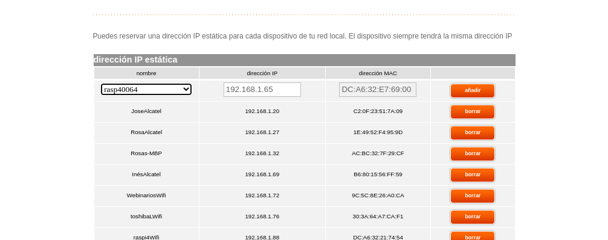
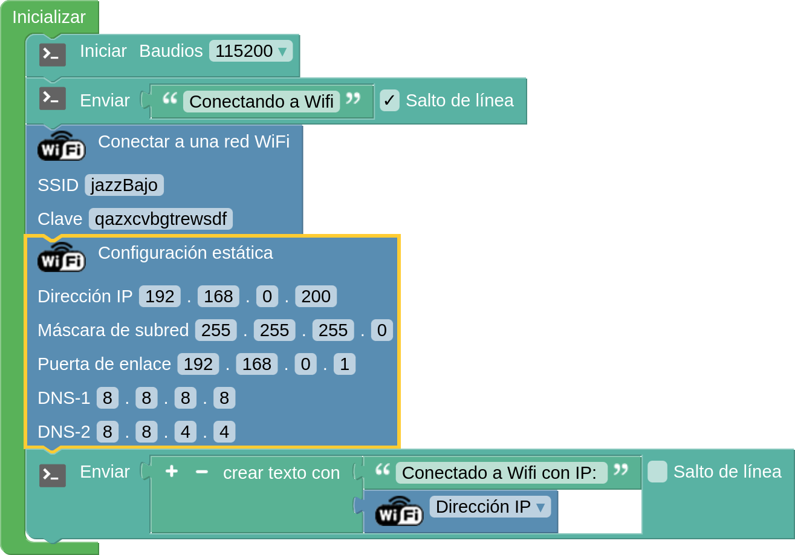
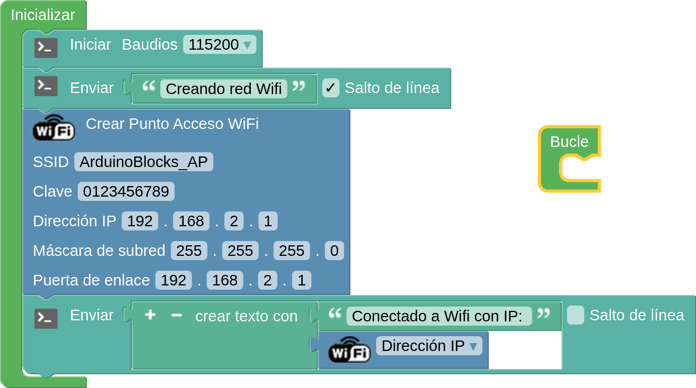

## Conexión a un wifi

Vamos a comenzar conectando a un wifi externo

### Conexión Wifi con ArduinoBlocks

Vamos a conectar nos a un wifi externo obteniendo la IP que nos proporcione el router. 

[Programa para conexión Wifi externo](http://www.arduinoblocks.com/web/project/791600)




Una vez subido el programa vemos en la consola el resultado:




Desde la mayoría de routers podemos hacer que a partir de ahora siempre se asigne esa IP al dispositivo:



Si queremos establecer una IP fija concreta, podemos hacerlo desde nuestro código:

[Programa Conexión Wifi externo IP fija](http://www.arduinoblocks.com/web/project/791661)




### Conexión wifi con código

Este es un sencillo ejemplo de conexión a un wifi con código:

```C++
#include <WiFi.h>
#include <WiFiClient.h>

#include "config.h"  // Cambiamos  el SSI y la clave en el fichero config.h

const int led = LED_BUILTIN;

void setup() {
  pinMode(led, OUTPUT);
  digitalWrite(led, 0);
  Serial.begin(115200);
  Serial.print("Conectando a ");
  Serial.print(ssid);  
  WiFi.mode(WIFI_STA);
  WiFi.begin(ssid, password);
  Serial.println("");

  // Wait for connection
  while (WiFi.status() != WL_CONNECTED) {
    delay(500);
    Serial.print("."); // imprime "." mientras intenta conectarse
  }
  Serial.println("");
  Serial.print("Conectado a ");
  Serial.println(ssid);
  Serial.print("IP address: ");
  Serial.println(WiFi.localIP());

}

void loop() {}

```

[Código](https://github.com/javacasm/CursoIOTCo/blob/main/codigo/3.8.0.wifi_base/3.8.0.wifi_base.ino)

1. Cambiamos las credenciales de la wifi en el fichero config.h
  
1. Buscamos redes con el ejemplo WifiScan


## Error: Brownout detector was triggered

Al empezar a usar Wifi (o Bluetooth) vamos a ver que la placa empieza a consumir más. Por eso podemos encontrarnos errores inesperados

Error producido por mala alimentación.
* Lo más probable que el cable USB sea de mala calidad
* Baja alimentación del puerto USB
* Suele producirse al usar Wifi o Bluetooth
[Explicación](https://github.com/nkolban/esp32-snippets/issues/168)

## Creando nuestro propia red Wifi

Podemos crear nuestra propia red Wifi, a la que se podrán conectar otros dispositivos:

[Creando red Wifi](http://www.arduinoblocks.com/web/project/791663)



