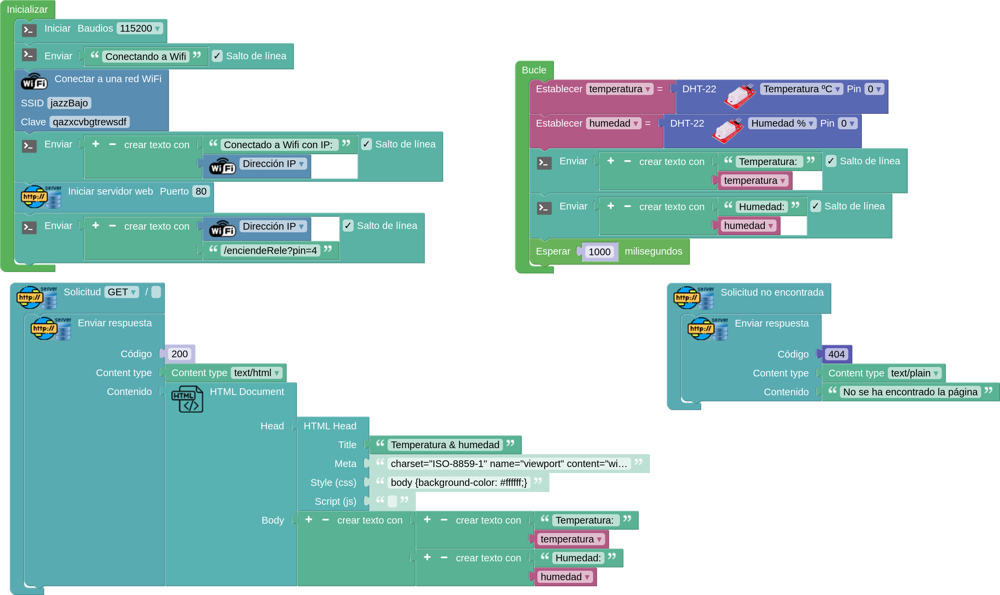

## Servidor Web básico (Base_webserver)

Ahora vamos a hacer un sencillo ejemplo de servidor Web, donde publicaremos mensajes usando este protocolo HTTP. Para ver su contenido usaremos un navegador Web indicándole la dirección de nuestra placa

* ¿Qué es un servidor web?: 
* ¿Qué es HTTP?: es el idioma que hablan entre el servidor y nuestro navegador para entenderse
* ¿Qué es HTML?: es el lenguaje en el que están escritas las páginas web.

Una página web HTML tiene este formato:

```HTML
<html>
<head>
<title>Título de la página</title>
</head>
<body>

<h1>Titular de nivel 1</h1>
<p>Esto sería un párrafo</p>
Contenido de la página
</body>
</html>
```

### Ejemplo con ArduinoBlocks

Este ejemplo nos nos permite publicar los datos de nuestros sensores en una sencilla página web:

* Nos conectamos a nuestra red wifi
* Mostramos el valor de la IP por la consola
* Creamos el servidor web
* Medimos los sensores y guardamos el valor en sus variables
* Cuando un navegador/cliente se conecta a nuestra IP le enviamos una sencilla página donde mostramos los valores medidos

[Servidor Web Humedad & Temperatura](http://www.arduinoblocks.com/web/project/791669)



Para probarlo, una vez subido el programa a nuestra placa abriremos un navegador con la IP que vemos en la consola.

Si no aparece el valor de la IP en la consola puede ser que nuestra placa no consigue conectar con la red wifi y debemos verificar los datos de acceso.

