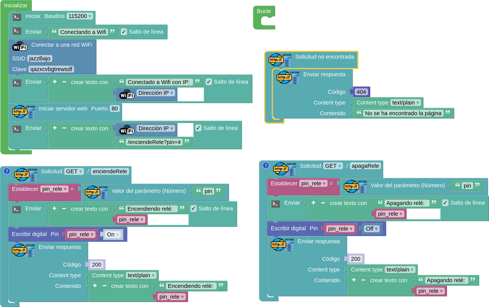
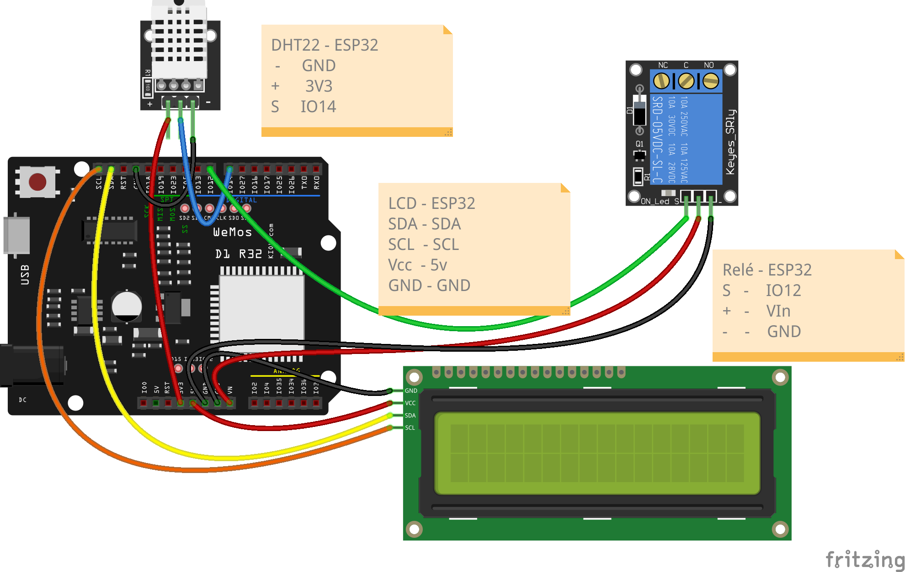

## Control de relés via Web

Vamos a crear una página web para controlar vía web unos relés conectados

[Programa - Control web de reles](http://www.arduinoblocks.com/web/project/791665)



Accederemos con [http://192.168.1.x/enciendeRele?pin=2](http://192.168.1.x/enciendeRele?pin=2) o con [http://192.168.1.x/apagaRele?pin=2](http://192.168.1.x/apagaRele?pin=2)


### Control de luz del LCD con relé



[Sensor DHT22 - LCD - WEB - control](http://www.arduinoblocks.com/web/project/817766)


### Control de pines vía web con código

Vamos a usar un formulario web para controlar remotamente los pines de nuestra placa.


```html
<HTML>
<head></head>
<body>
<center><form action='/'>
<button name='comando' type='submit' value='1'>ON Rele</button>
<button name='comando' type='submit' value='2'>ON Led</button><br>
<button name='comando' type='submit' value='3'>OFF Rele</button>
<button name='comando' type='submit' value='4'>OFF Led</button>
<br><a href=\"https://github.com/javacasm/CursoIOTCo/tree/main/codigo/control_web\">Codigo</a>
<br>
</form></center>
</body>
</HTML>
``` 
        
Procesaremos la respuesta buscando el valor que se le ha asignado a la variable "comando" y en función de ese valor encenderemos o apagaremos los relés.

```C++
int comando = server.arg("comando").toInt();
switch (comando)
{
    case 1:
        digitalWrite(rele,HIGH);
        break;
    case 2:
        digitalWrite(led,HIGH);
        break;
    case 3:
        digitalWrite(rele,LOW);
        break;
    case 4:
        digitalWrite(led,LOW);
        break;
```                
                
[Codigo](https://github.com/javacasm/CursoIOTCo/tree/main/codigo/3.9.2.control_web)                
