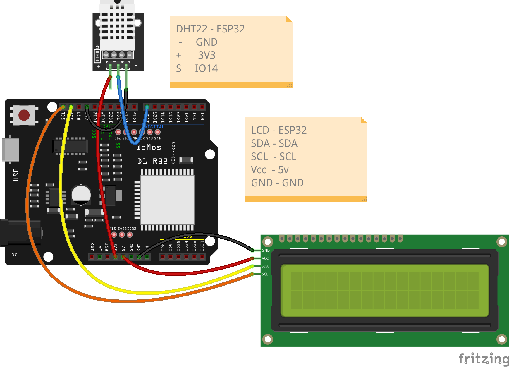
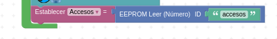
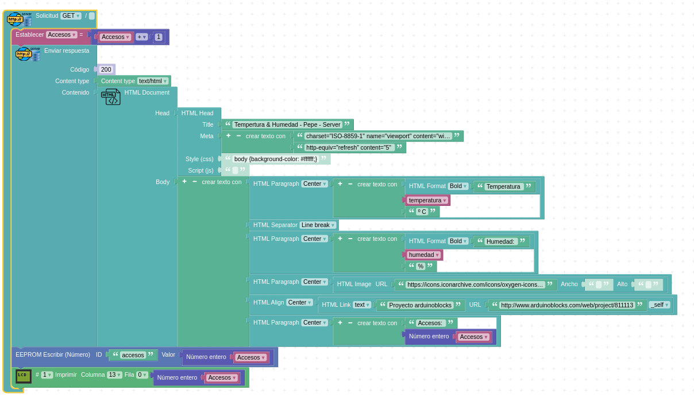
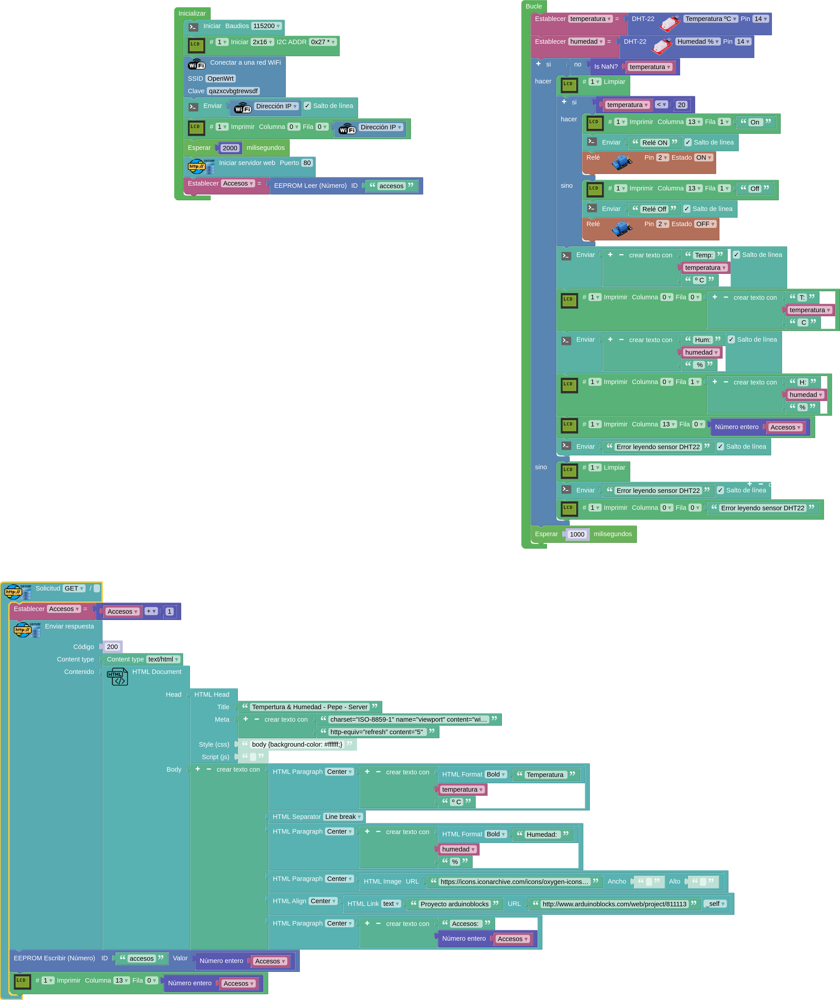

## Servidor web avanzado

* Variable **accesos** que guarda el número de veces que se visualiza la página. 

    * Se guarda en eeproom y se recupera al cargarlo
    * Cada vez que se accede a la página se incrementa la variable y se vuelve a guardar en eeprom

* Creamos una página HTML con:

    * Imágenes
    * Enlaces
    * Formato: párrafo y alienado

[DHT, LCD, Web meteo](http://www.arduinoblocks.com/web/project/811113)

