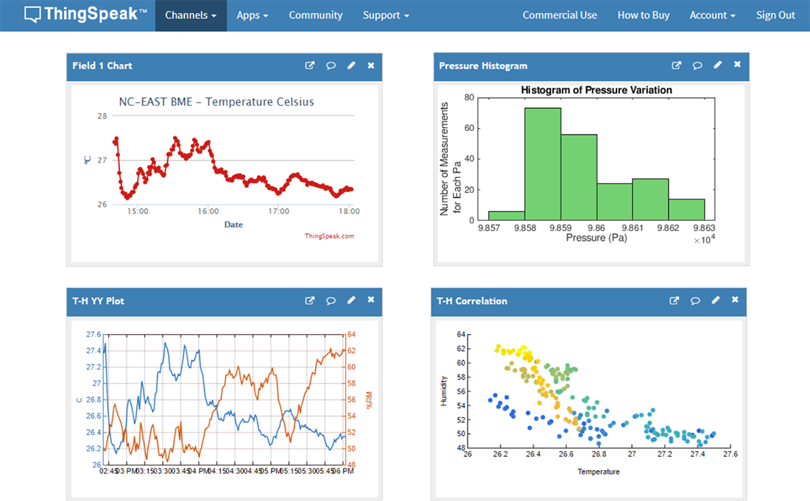

## Publicación de datos de IOT en servicios externos

Dado que nuestros equipos van a generar datos, necesitamos un lugar donde almacenarlos para poder consultarlos y extraer información relevante de ellos. Para ello usaremos ordenadores externos (servidores) a los cuales se conectaran nuestros dispositivos IOT, enviando sus datos. Estos servidores los almacenarán, permitiéndonos procesarlos y visualizarlos en forma de gráficos o informes detallados. 

Solemos englobar estos sistemas externos en el concepto de "la nube", sin entrar en más detalles sobre su arquitectura o funcionamiento. Existen multitud de estos servicios, algunos nos permiten publicar contenidos en redes sociales (como Twitter y Facebook), otros nos facilitan el almacenar nuestros datos y mostrarlos como gráficas. Además estos servicios  dan una dimensión social a nuestros datos pudiendo compartirlos con otros usuarios.

Estos servicios online, o en la nube como ahora se suele decir, exponen una serie de reglas para acceder a ellos. Es lo que se conoce de forma genérica como un API (Application Programming Interface) y será el "lenguaje" que tendrán que hablar nuestros dispositivos para entregar los datos.

También podemos implementar nosotros mismos estos servicios sin depender de servicios externos, pero para ello tenemos que tener conocimientos un poco más avanzados. Para empezar te recomiendo usar alguno de los siguientes que vamos a ver

### Plataformas de publicación de datos

La mayoría de estas plataformas nos permiten subir nuestros datos y obtener gráficas con ellos, como estos:

Además algunas nos permiten establecer disparadores (trigger) para vigilar que algún dato tome cierto valor, en cuyo caso envían un aviso a nuestro sistema o realizan alguna acción.

Casi todas las plataformas tienen una versión gratuita y limitada (limitación en la frecuencia de envío de los datos o en el volumen de estos) y otra profesional de pago. Normalmente para nuestros montajes y proyectos podemos usar la gratuita.

* Adafruit IO https://io.adafruit.com/
* Thingspeak https://thingspeak.com/
* Blynk  https://blynk.io/
* Cayenne https://mydevices.com/ 
* Grafana https://grafana.com/
* Connect2me https://www.c2m.net
* All Things Talk https://www.allthingstalk.com/

Este es un mercado muy cambiante y puede ser que alguno de ellos deje de estar disponible o cambie de URL de acceso.

