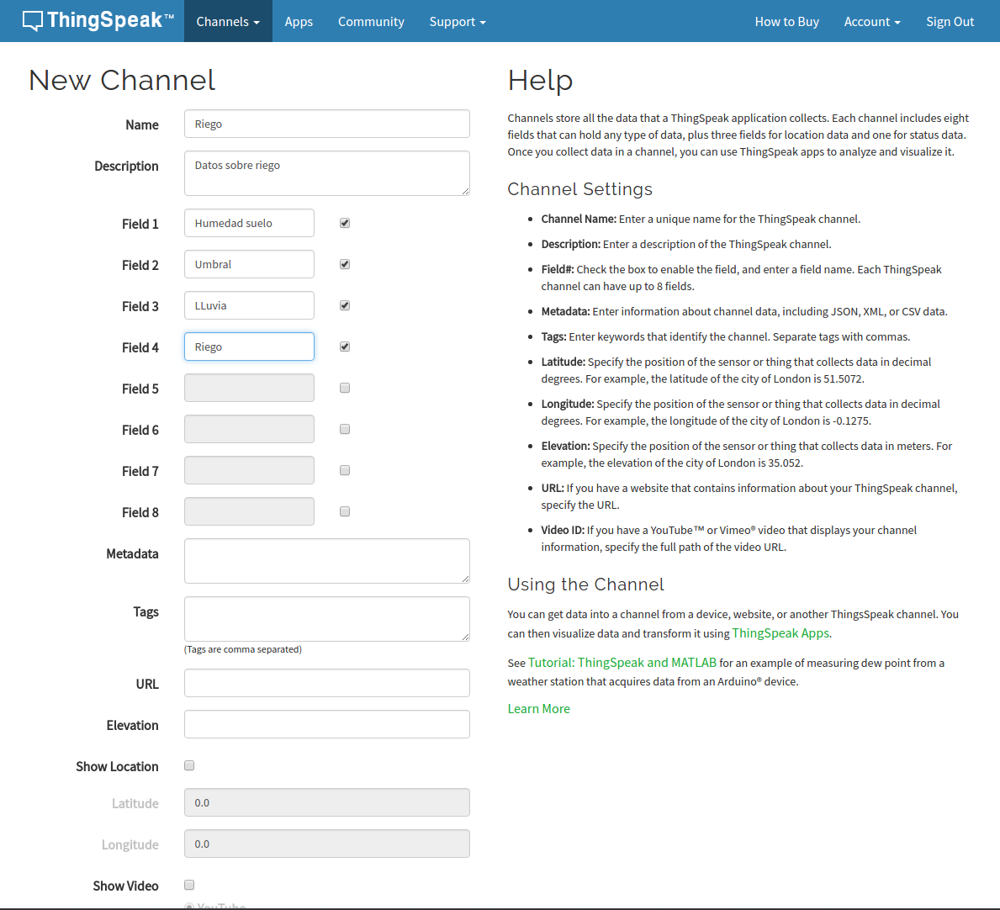
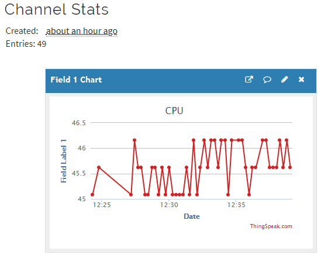

## Publicación en ThingSpeak

ThingSpeak es una servicio web que nos permite publicar datos de las medidas de nuestros dispositivos IOT (o de cualquier otro).


Es gratuito para cierto número de datos y nos permite de manera muy sencilla subir datos.

### Creación del canal (Channel)

* Nos hacemos una cuenta en ThingSpeak, recibiremos un email y lo verificamos.

* Entramos en Channels->My Channels y pulsamos en "New Channel".


* Configuraremos el canal, indicando los datos que se van a enviar. Podemos añadir una descripción y datos como la web, canal de youtube, etc...



* Para poder enviar datos al canal necesitamos el API KEY que lo identifica que incluiremos en nuestro código.


* Para que cualquiera pueda ver los datos, podemos hacer que el canal sea público, desde la pestaña Sharing.


* Una vez creado el canal podemos configurar los detalles de cada gráfico, para lo que pulsaremos sobre el icono "lápiz" de cada uno.

* En cualquier momento podemos importar/exportar los datos de un gráfico dado.


### Código Arduino 

Éste es el código de ejemplo para Arduino ...

Instalamos la librería de thingSpeak


En el código cambiaremos las claves de thingspeak escritura y el código de nuestro canal:


```C++

```

[TODO: Código del ejemplo]()


Podremos ver el gráfico en su correspondiente canal



