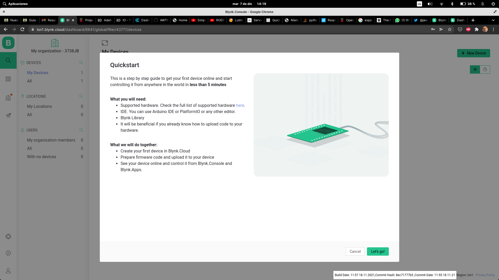
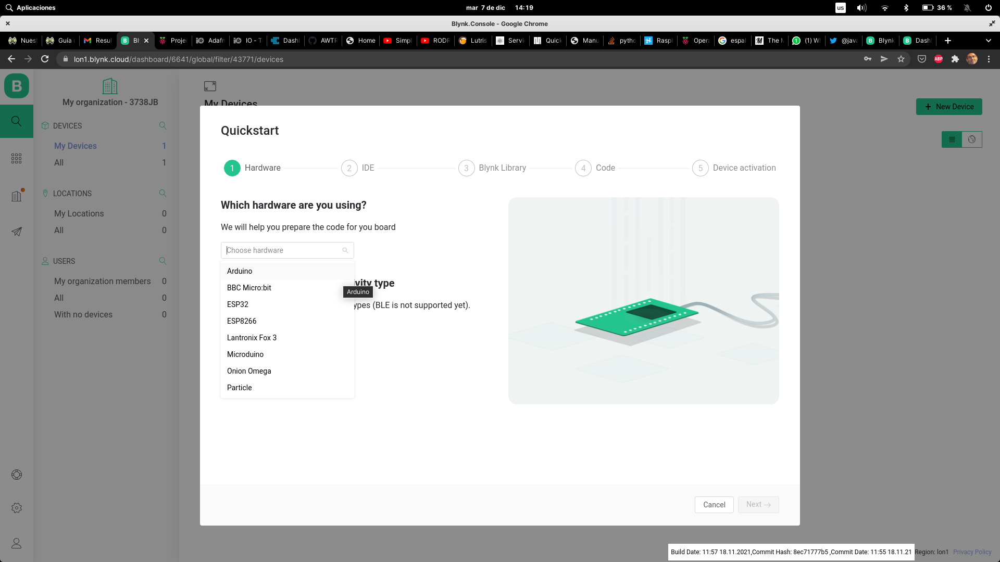
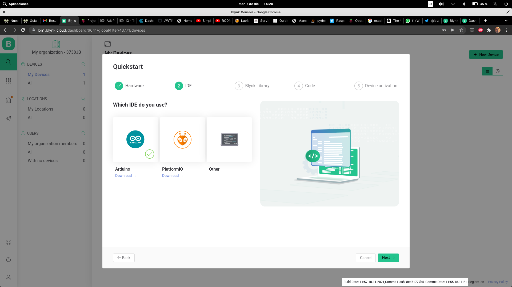
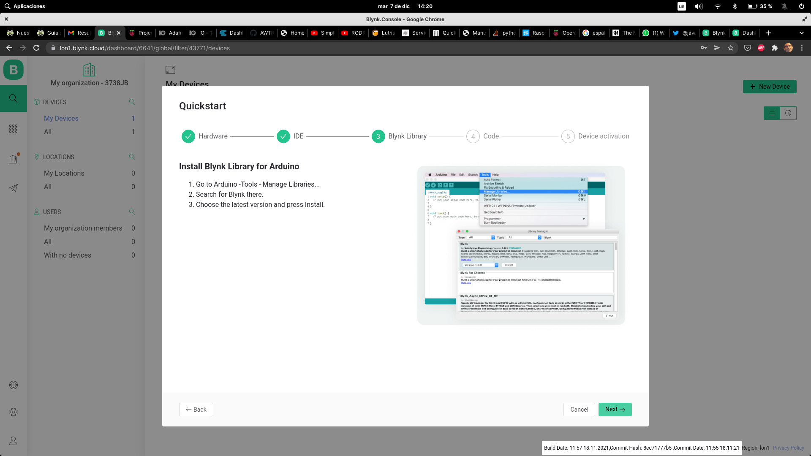
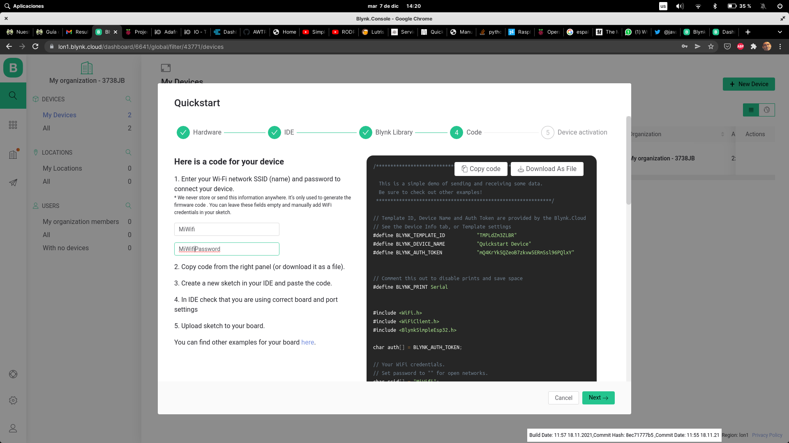
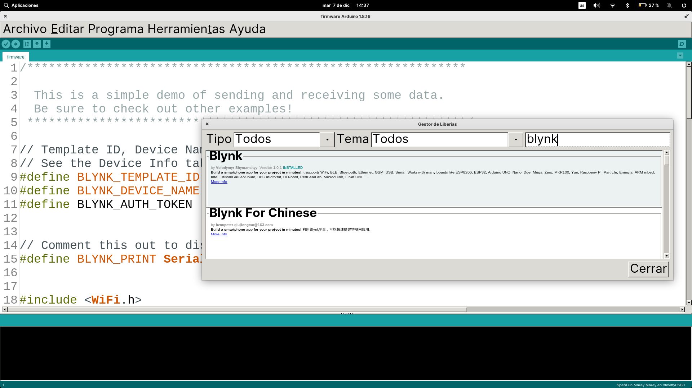
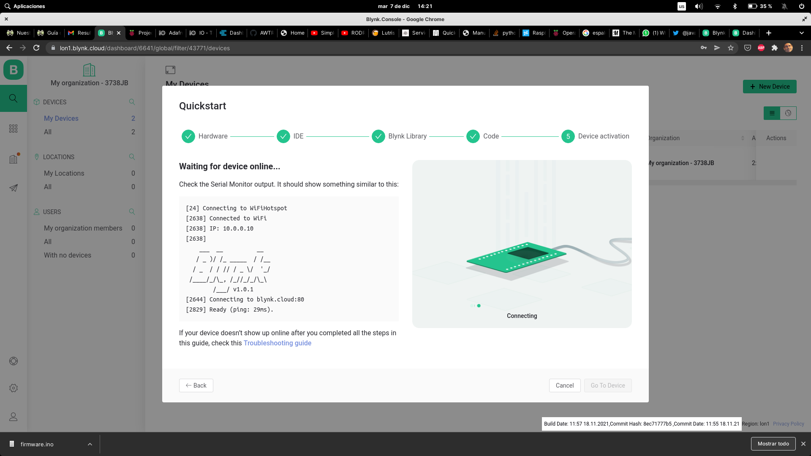
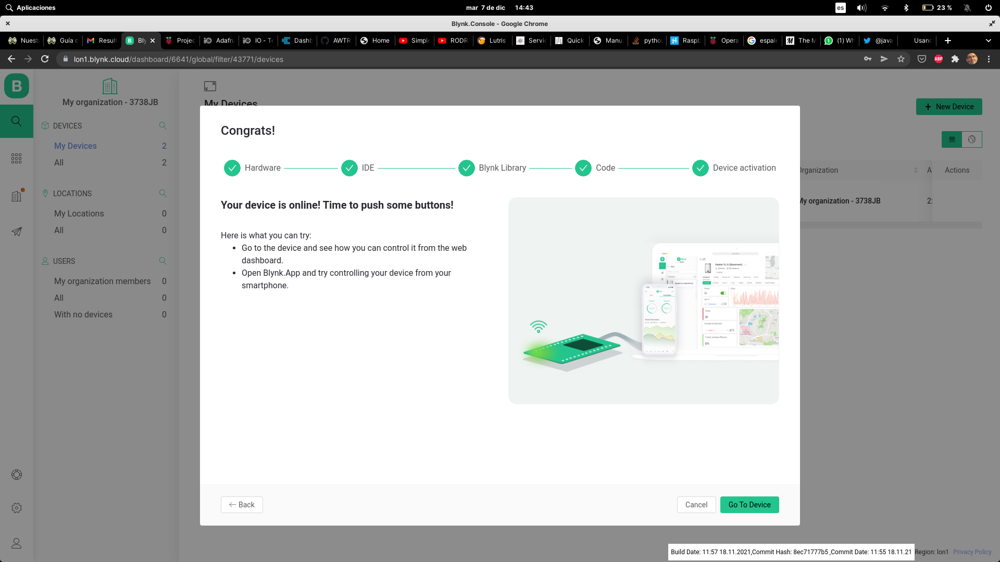

# Blynk

Blynk es un servicio IOT que nos permite conectar nuestros dispositivos IOT de una forma muy sencilla. Nos permite almacenar datos en la nube y acceder a nuestros dispositivos

Como en la mayoría de estos servicios dispone de un [servicio gratuito](https://blynk.io/pricing#plan-comparison) y [otros de pago de mayor capacidad](https://blynk.io/pricing#plan-comparison). En el modelo gratuito podemos controlar hasta 2 dispositivos y podemos dar de alta 5 usuarios que controlarán los dispositivos.

Para empezar a utilizarlo nos creamos una cuenta y al validar nuestro email ya podemos empezar a usarlo, siguiendo los sencillos pasos del tutorial "Quick Start" que se muestra por defecto al crear la cuenta (también podemos ejecutarlo desde el menú de tutoriales) y que nos guiará de una manera muy sencilla por nuestro primer ejemplo con Blynk:





1. Seleccionamos el hardware que vamos a utilizar y para el que se generará el código


2. Seleccionamos el tipo de comunicaciones que vamos a usar (wifi en nuestro caso)



3. Seleccionamos el IDE con el que trabajaremos (Arduino en nuestro caso), que previamente habremos configurado para usar con nuestro hardware



4. Nos explican como instalarnos la librería **Blynk** que necesitamos para el ejemplo, en nuestro IDE



5. Instalamos la librerías




6. Nos muestra el código de ejemplo que usaremos y que tras rellenar con los datos de conexión de nuesrro wifi, podemos descargar, compilar y subir a la placa



7. Abrimos el monitor serie y esperamos a que nuestra placa se conecte

```
[25] Connecting to OpenWrt
[3160] Connected to WiFi
[3160] IP: 192.168.1.33
[3161] 
    ___  __          __
   / _ )/ /_ _____  / /__
  / _  / / // / _ \/  '_/
 /____/_/\_, /_//_/_/\_\
        /___/ v1.0.1 on ESP32

[3166] Connecting to blynk.cloud:80
[3646] Ready (ping: 305ms).
```



8. Tras conectarse, el tutorial finaliza con esta primera comprobación

Desde nuestra cuenta podemos ver el estado de conexión del dispositivo **Device info**, los datos enviados **Dashboard**, 

### Blynk App

Blink dispone de una [App](https://play.google.com/store/apps/details?id=cloud.blynk) con la podemos ver los datos y controlar los dispositivos conectados

[Ejemplos](https://examples.blynk.cc/?board=ESP32&shield=ESP32%20WiFi&example=Widgets%2FLED%2FLED_Blink)

