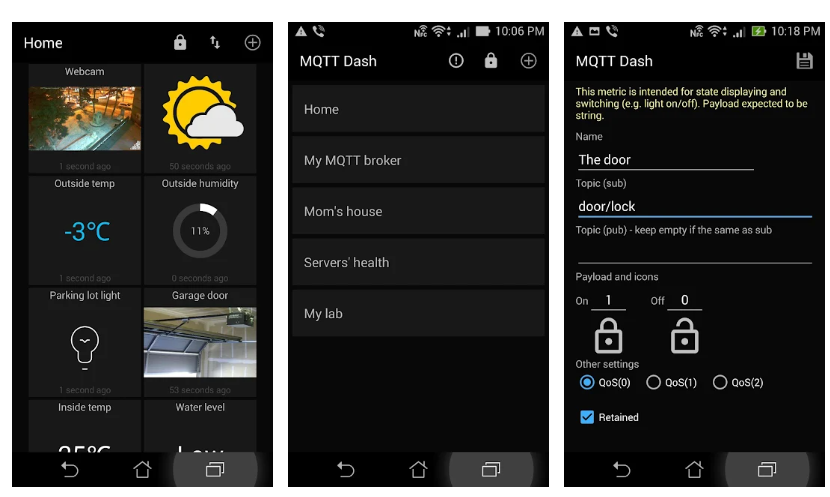

## MQTT

Para comunicarnos con estas plataformas de IOT necesitamos utilizar un lenguaje (protocolo) común. Podemos usar HTTP como ya vimos antes, pero no es lo más eficiente.

Vamos a ver uno de los protocolos más usados en los sistemas IOT/domóticos: el MQTT.

**MQTT** es un protocolo de comunicación entre dispositivos sencillo y ligero. Está pensado para que pueda funcionar en equipos con poca capacidad de cálculo pero sin limitar sus características. Podemos ver todos los detalles del protocolo en [su web](https://mqtt.org/) donde se encuentran las especificaciones y versiones de software que lo implementan.

Es un protocolo seguro que soporta autenticación y cifrado SSL, aunque podemos elegir no usar estas características.

También implementa distintos niveles de QoS (Quality of Service) que van desde un nivel 0 sin garantía de entrega de paquetes/notificaciones hasta un nivel máximo donde se asegura que todos los paquetes se reciben.

Todo ello hace que este protocolo sea muy útil y versátil, capaz de funcionar entre grandes servidores y entre sistemas de microcontroladores.

Los equipos conectados por **MQTT** envían y reciben mensajes que están formados por un **Topic**, que es como una etiqueta con estructura arbórea y un **mensaje** o contenido.

Decimos que los topic tienen estructura arbórea porque podemos estructurarlos y además usar comodines ('+' y '#'). 

Por ejemplo si decimos que estamos interesados en el topic "/MeteoSalon/#" diremos que nos interesan todos los mensajes que empiecen por "/MeteoSalon/". 

Si decimos que queremos suscribirnos a los topics de la forma "/sensores/+/Temperatura" recibiremos todos los que tenga esa estructura sin importar si son "/sensores/10/temperatura" o "/sensores/9/temperatura" o cualquier otro con ese formato.

Todos los participantes pueden **publicar** mensajes y/o también se pueden **suscribir** a determinados topics, de manera que reciban los mensajes con ese topic.

Utiliza una arquitectura como la que se ve en la imagen, donde el sistema central actúa como **Broker**, recibiendo los mensajes de todos los equipos y notificando a aquellos que se han suscrito a topics.


Al ser un servicio sencillo actúa como transporte en sistemas más complejos. Por ejemplo, podemos hacer que un equipo se suscriba a todos los topics y los guarde en una base de datos. 


Existen brokers accesibles (y gratuitos para cierto número de peticiones) a través de internet como por ejemplo el de [HiveMQ](https://www.hivemq.com/public-mqtt-broker/) o [el de Adafruit](https://io.adafruit.com/) o [este mismo de mosquitto org](https://test.mosquitto.org/). En [esta página](https://diyprojects.io/8-online-mqtt-brokers-iot-connected-objects-cloud/#.XwoEW9_ni-g) tenemos un listado.


### Ejemplo de arquitectura de topics

A medida que vamos añadiendo dispositivos y enviado más mensajes se puede complicar el árbol de topics

Para ellos es mejor usar una arquitectura. Por ejemplo esta, [tomada del blog de ricardo veal](https://ricveal.com/blog/sonoff-mqtt/)

```sh
    state_topic: "stat/sonoff/1/POWER"
    command_topic: "cmnd/sonoff/1/POWER"
    availability_topic: "tele/sonoff/1/LWT"
```
_Telemetría_ para que den información, por ejemplo los sensores.
_Command_ para peticiones 
_Stat_ para confirmaciones de estados


### App control MQTT

Existen muchas aplicaciones pensadas para conectar con brokers MQTT, como por ejemplo [MQTT Dashboard](https://play.google.com/store/apps/details?id=net.routix.mqttdash&hl=es_419&gl=US)



Que nos permite conectar con diferentes brokers, creando paneles para ver datos y controlarlos.
