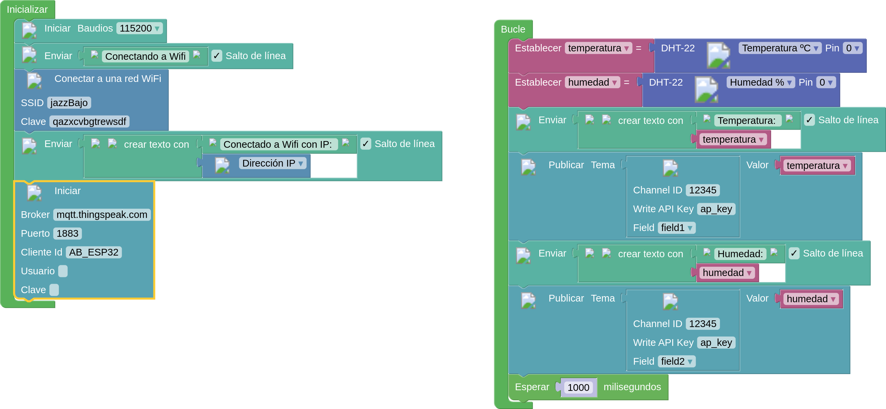

# Publicación en ThingSpeak con MQTT

## Ejemplo ArduinoBlocks

Configuraremos el servidor MQTT: mqtt.thingspeak.com

[Envío a ThingSpeak de Temperatura y Humedad](http://www.arduinoblocks.com/web/project/791684)

