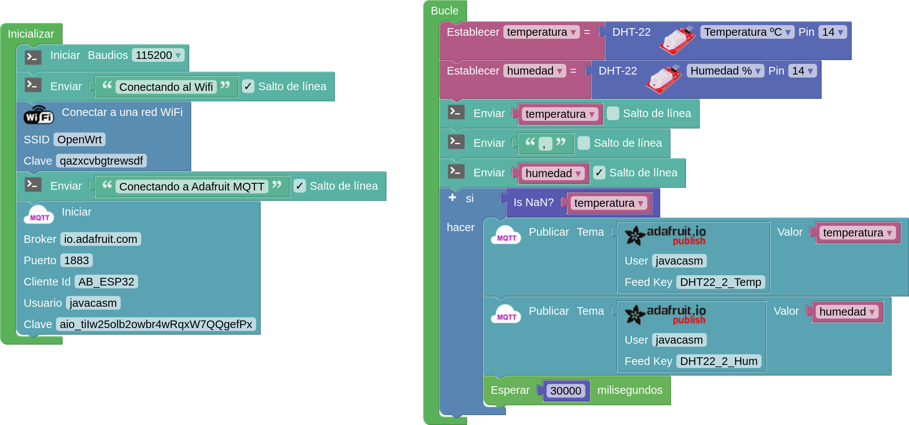
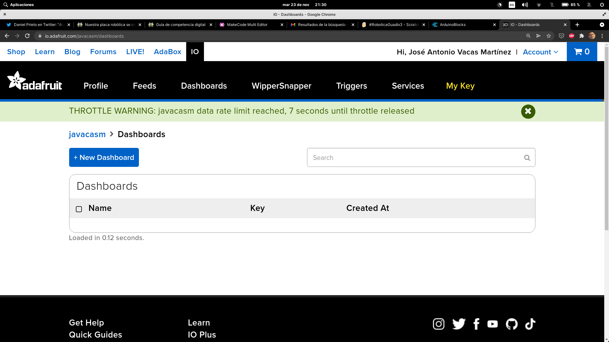
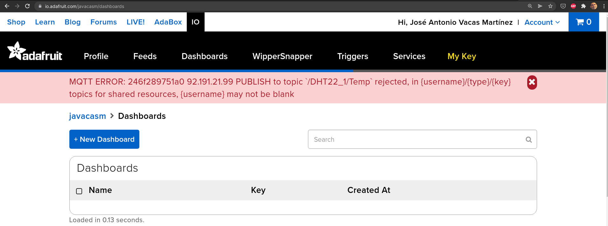

## Configuración de la conexión

Host	io.adafruit.com
Secure (SSL) Port	8883
Insecure Port	1883
MQTT over Websocket	443
Username	Your Adafruit IO Username
Password	Your Adafruit IO Key

[DHT22 - Adafruit - MQTT - ESP32](http://www.arduinoblocks.com/web/project/609089)

### Ejemplo codigo

[Librerías](https://io.adafruit.com/api/docs/mqtt.html#client-libraries)

[Código Librería Arduino](https://github.com/adafruit/Adafruit_MQTT_Library)

[Cuenta](https://accounts.adafruit.com/settings/profile)

[Perfil](https://io.adafruit.com/javacasm/profile)

CUIDADO CON PUBLICAR LA CLAVE ..... 

Subscripción a los errors y a throttle

[errores](https://io.adafruit.com/blog/example/2016/07/06/mqtt-error-reporting/)

[Códigos de error del protocolo MQTT](https://www.vtscada.com/help/Content/D_Tags/D_MQTT_ErrMsg.htm)

4 - Error en el login
5 - Error de autorización ¿hemos enviado más datos o más rápido de la cuenta? ¿es válido mi key/token?

[qué es](https://learn.adafruit.com/welcome-to-adafruit-io/what-is-adafruit-io)

[Api](https://io.adafruit.com/api/docs/mqtt.html?python#adafruit-io-mqtt-api)

[Feed](https://io.adafruit.com/javacasm/feeds/dht22-2-temp)

