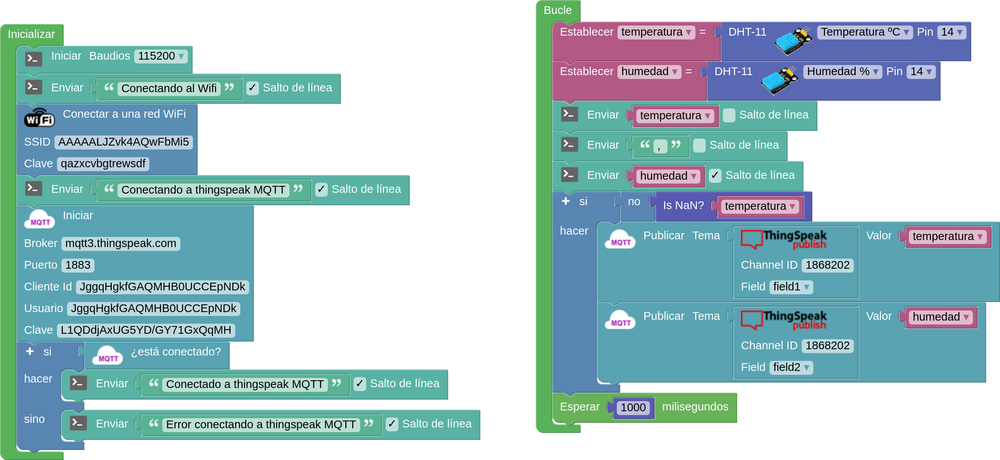

# Publicación en ThingSpeak con MQTT

## Ejemplo ArduinoBlocks

Para publicar nuestros datos en ThingSpeak usando el protocolo MQTT necesitamos recuperar nuestros datos de conexión de nuestra cuenta así como el chanelID. 

En el programa tendremos que:

* Parte de inicializar
    - Configurar la conexión Wifi
    - Añadir el bloque de conexión MQTT donde pondremos:
        * Broker MQTT: mqtt3.thingspeak.com
        * Nuestro client ID
        * Username
        * Clave
    - Comprobamos si estamos conectados

* Bucle:
    - Leemos los datos del sensor
    - Comprobamos que son válidos (distintos de Nan)
    - Publicamos cada dato con el bloque "Publicar Topic" usando el channelID, el topic y el valor del sensor.
    

[Envío a ThingSpeak de Temperatura y Humedad](http://www.arduinoblocks.com/web/project/editor/920380)

