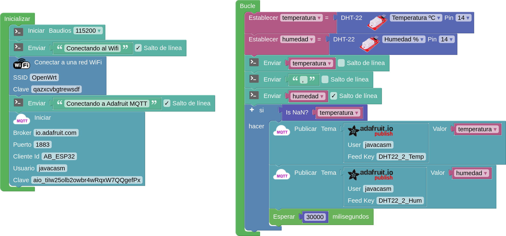

## Configuración de la conexión con Adafruit IO

Otro servicio muy interesante es el [adafruit.io](adafruit.io), donde también nos crearemos una cuenta para acceder y configuraremos los tableros (dashboard)

Para la conexión usaremos:

* Broker: io.adafruit.com
* Puerto: 1883 (También están disponibles Secure (SSL) Port	8883 y MQTT over Websocket	443)
* Usuario
* Clave: nuestra Adafruit IO Key

Vemos que el programa es muy similar al anterior sólo que ahora hemos usado los bloque de publicación MQTT de adafruit

[DHT22 - Adafruit - MQTT - ESP32](http://www.arduinoblocks.com/web/project/609089)

Si intentamos enviar datos muy rápido la página de adafruit.io nos avisará con el mensaje en verde si es sólo un aviso:

En rojo si es un error grave

