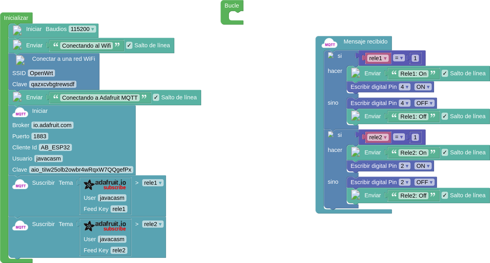
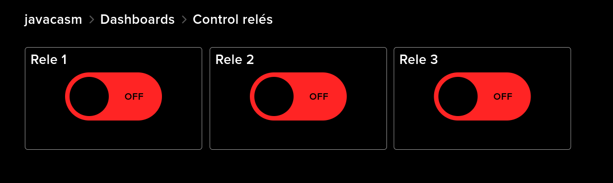

## Control remoto adafruit

Vamos a modificar el programa que utilizamos para publicar datos en Adafruit IO, para ahora poder controlar unos relés remotamente.

Hemos conectado 2 relés a los pines 2 y 4. Son relés de lógica negativa, es decir al activar su señal de control se apagan y se encienden al apagarla. Los alimentamos desde los 5V de la placa, aunque funcionan perfectamente con los 3.3V de la señal de salida de los pines del ESP32.

Vamos a suscribirnos a los topics de los relés, que serán **rele1** y **rele2**. Cuando recibamos un mensaje con el topic releX se guardará en la variable correspondiente el valor del mensaje. En función de ese valor activaremos o no el relé correspondiente.

[Control - Adafruit - MQTT - ESP32](http://www.arduinoblocks.com/web/project/791707)

En Adafruit IO hemos creado los correspondientes feeds rele1,rele2 y rele3 y los ponemos en un dashboard con controles de botón (toggle)

Configurando cada uno para que muestre su nombre, vinculado a su correspondiente feed y que tenga el valor 1 ó 0 cuando esté activo o apagado.

Cuando nosotros actuamos sobre el control se publica un mensaje con el topic del feed y el valor del control

