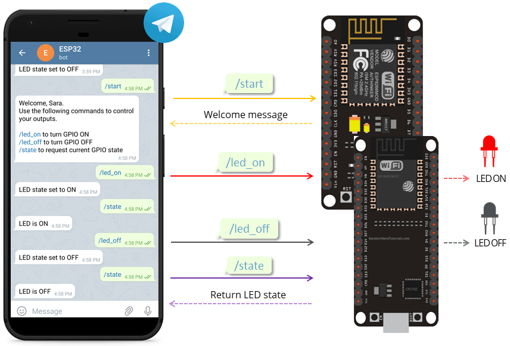
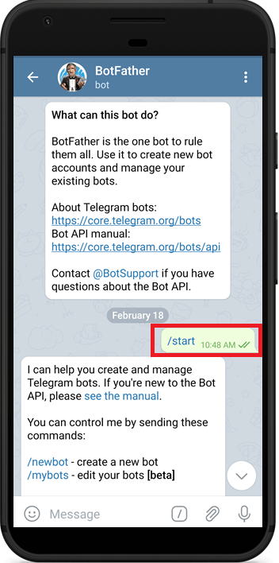

## Telegram Bot



1. Instalamos la app Telegram
2. Creamos el canal con @botfather



3.Conseguimos nuesto ID con /getid en t.me/myidbot 

4. Descargamos la [librería TelegramBot](https://github.com/witnessmenow/Universal-Arduino-Telegram-Bot/archive/master.zip) para ESP32
5. Instalamos la librería __ArduinoJson__ desde el gestor de librerías
6. Usamos el [ejemplo de Random Nerd Tutorial](https://randomnerdtutorials.com/telegram-control-esp32-esp8266-nodemcu-outputs/)

```C++
/*
  Rui Santos
  Complete project details at https://RandomNerdTutorials.com/telegram-control-esp32-esp8266-nodemcu-outputs/
  
  Project created using Brian Lough's Universal Telegram Bot Library: https://github.com/witnessmenow/Universal-Arduino-Telegram-Bot
  Example based on the Universal Arduino Telegram Bot Library: https://github.com/witnessmenow/Universal-Arduino-Telegram-Bot/blob/master/examples/ESP8266/FlashLED/FlashLED.ino
*/

#ifdef ESP32
  #include <WiFi.h>
#else
  #include <ESP8266WiFi.h>
#endif
#include <WiFiClientSecure.h>
#include <UniversalTelegramBot.h>   // Universal Telegram Bot Library written by Brian Lough: https://github.com/witnessmenow/Universal-Arduino-Telegram-Bot
#include <ArduinoJson.h>

// Replace with your network credentials
const char* ssid = "REPLACE_WITH_YOUR_SSID";
const char* password = "REPLACE_WITH_YOUR_PASSWORD";

// Initialize Telegram BOT
#define BOTtoken "XXXXXXXXXX:XXXXXXXXXXXXXXXXXXXXXXXXXXXXXXXXXXX"  // your Bot Token (Get from Botfather)

// Use @myidbot to find out the chat ID of an individual or a group
// Also note that you need to click "start" on a bot before it can
// message you
#define CHAT_ID "XXXXXXXXXX"

#ifdef ESP8266
  X509List cert(TELEGRAM_CERTIFICATE_ROOT);
#endif

WiFiClientSecure client;
UniversalTelegramBot bot(BOTtoken, client);

// Checks for new messages every 1 second.
int botRequestDelay = 1000;
unsigned long lastTimeBotRan;

const int ledPin = 2;
bool ledState = LOW;

// Handle what happens when you receive new messages
void handleNewMessages(int numNewMessages) {
  Serial.println("handleNewMessages");
  Serial.println(String(numNewMessages));

  for (int i=0; i<numNewMessages; i++) {
    // Chat id of the requester
    String chat_id = String(bot.messages[i].chat_id);
    if (chat_id != CHAT_ID){
      bot.sendMessage(chat_id, "Unauthorized user", "");
      continue;
    }
    
    // Print the received message
    String text = bot.messages[i].text;
    Serial.println(text);

    String from_name = bot.messages[i].from_name;

    if (text == "/start") {
      String welcome = "Welcome, " + from_name + ".\n";
      welcome += "Use the following commands to control your outputs.\n\n";
      welcome += "/led_on to turn GPIO ON \n";
      welcome += "/led_off to turn GPIO OFF \n";
      welcome += "/state to request current GPIO state \n";
      bot.sendMessage(chat_id, welcome, "");
    }

    if (text == "/led_on") {
      bot.sendMessage(chat_id, "LED state set to ON", "");
      ledState = HIGH;
      digitalWrite(ledPin, ledState);
    }
    
    if (text == "/led_off") {
      bot.sendMessage(chat_id, "LED state set to OFF", "");
      ledState = LOW;
      digitalWrite(ledPin, ledState);
    }
    
    if (text == "/state") {
      if (digitalRead(ledPin)){
        bot.sendMessage(chat_id, "LED is ON", "");
      }
      else{
        bot.sendMessage(chat_id, "LED is OFF", "");
      }
    }
  }
}

void setup() {
  Serial.begin(115200);

  #ifdef ESP8266
    configTime(0, 0, "pool.ntp.org");      // get UTC time via NTP
    client.setTrustAnchors(&cert); // Add root certificate for api.telegram.org
  #endif

  pinMode(ledPin, OUTPUT);
  digitalWrite(ledPin, ledState);
  
  // Connect to Wi-Fi
  WiFi.mode(WIFI_STA);
  WiFi.begin(ssid, password);
  #ifdef ESP32
    client.setCACert(TELEGRAM_CERTIFICATE_ROOT); // Add root certificate for api.telegram.org
  #endif
  while (WiFi.status() != WL_CONNECTED) {
    delay(1000);
    Serial.println("Connecting to WiFi..");
  }
  // Print ESP32 Local IP Address
  Serial.println(WiFi.localIP());
}

void loop() {
  if (millis() > lastTimeBotRan + botRequestDelay)  {
    int numNewMessages = bot.getUpdates(bot.last_message_received + 1);

    while(numNewMessages) {
      Serial.println("got response");
      handleNewMessages(numNewMessages);
      numNewMessages = bot.getUpdates(bot.last_message_received + 1);
    }
    lastTimeBotRan = millis();
  }
}
```


