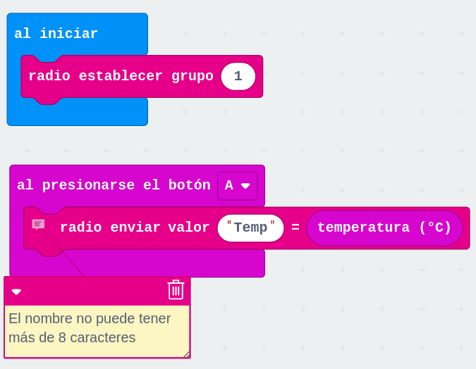
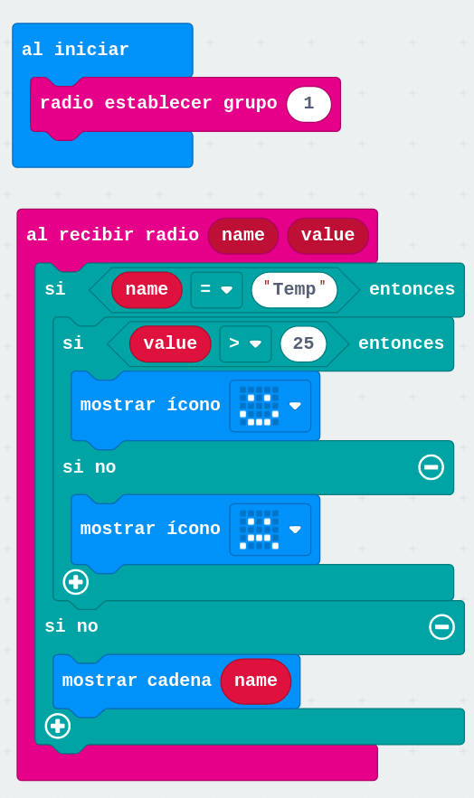

## Ejemplo de IOT con micro:bit

Entramos en el [modo entorno multi](https://makecode.com/multi#)

[Sensor Temperatura](https://makecode.microbit.org/_V6FWkeKMkdop)

[Broker](https://makecode.microbit.org/_YD1bHp6Yi1pV)

## micro:bit + ESP01 (wifi)

[Extensión de ThingSpeak para micro:bit](https://makecode.microbit.org/pkg/alankrantas/pxt-ESP8266_ThingSpeak)

[Webserver](https://www.intelek.edu.my/microbit-iot-wifi-web-server/)
