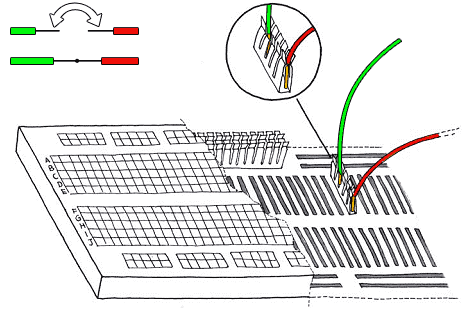
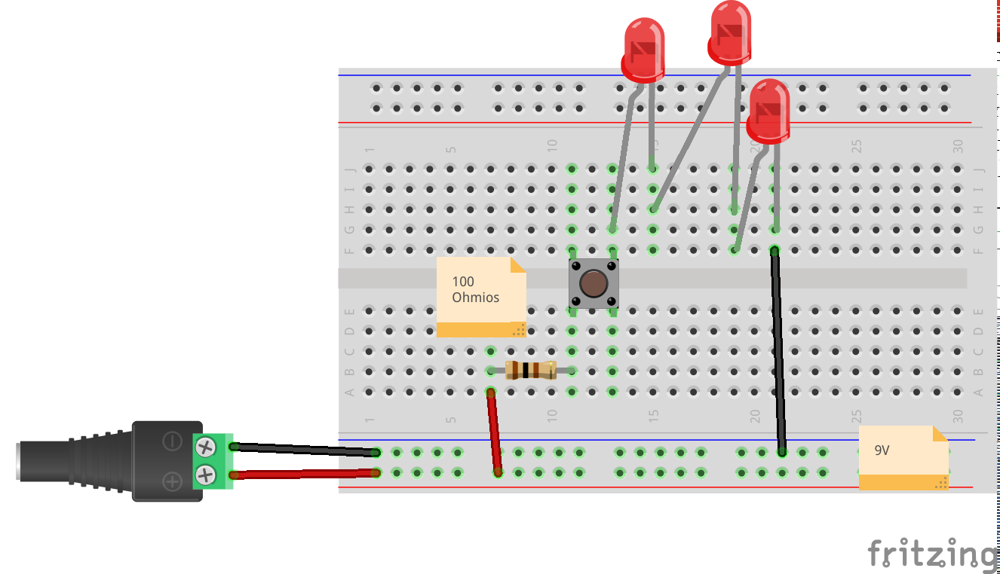
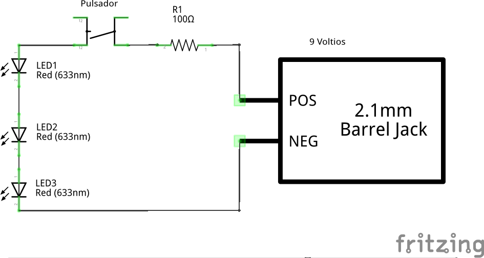

## Conceptos

1. Electricidad
  1. Tipos de corrientes
  1. Polaridad
  1. Circuitos
  1. Continuidad
1. Componentes
  1. Leds
  1. Resistencias
  
  1. Pulsadores e interruptores
1. Montajes sencillos
  1. Circuito básico
  1. Montaje serie
  1. Montaje paralelo
1. Cálculo en circuitos
  1. Ley de Ohm
  1. Ley de ¿Kirchoff?
  1. Cálculo

## Repaso de electrónica

En este capítulo vamos a ver unos vídeos de introducción a la electrónica. Los vídeos están orientados a la plataforma Arduino, pero todo lo que se comenta es aplicable a NodeMCU (y también Raspberry), salvo quizá algunos detalles como los voltajes máximos.

Comencemos con un [vídeo sobre electrónica básica](https://youtu.be/5sS1dqLO54w)

Ahora veremos un [vídeo](https://youtu.be/FD6N9x6bjHU) que nos explica el mundo analógico, cómo leer los valores y cuantizarlos.

[Presentación sobre electrónica](./documentacion/0.4_IntroduccionElectronica.pdf)

## Convenciones

* GND: cable de alimentación negativo, se suele llamar "tierra" (Ground en inglés). Se suele utilizar cable negro para conectarlos
* Vcc o Vin o V: cable de alimentación positivo, suele ser 5V y se suelen usar cables rojos para conectarlos. En las placas con varios voltajes hay que tener cuidado con ellos.

## Para saber más

Un [video-instructable](http://www.instructables.com/id/Basic-Electronics/) que empieza desde lo más fundamental y llega hasta montar un circuito oscilador con un 555. Lo más probable es que cualquiera que tenga una mínima inquietud por el tema se pueda saltar los primeros pasos, pero en cualquier caso vale la pena.

[Otro instructable](http://www.instructables.com/id/Electronics-made-easy/?ALLSTEPS) que explica diversos componentes y sus símbolos en los esquemas

Un [repositorio de circuitos](http://www.discovercircuits.com/list.htm) enorme.

Un [listado de bloques básicos](http://www.daycounter.com/Circuits/) para entender y crear circuitos electrónicos

## Prácticas a hacer

### Usando la placa de prototipo

La placa de prototipo o protoboard sirve como una regleta de conexiones, facilitando la interconexión entre los dispositivos.

En esta imagen vemos como nos permite conectar dos cables (el verde y el rojo)

Internamente tienen unas placas metálicas que establecen los contactos

Las lineas azules y rojas se suelen usar para conectar llevar la alimentación a todos los componentes y representan la línea roja a la que se suele conectar el cable positivo y una negra o azul, a la que conectaremos el cable negativo o GND.

Hay que tener en cuenta que algunos fabricantes no conectan toda la línea de alimentación, sino sólo la mitad

[Corte en las lineas de alimentación](./images/protoboard_Separacion.jpg)

### Montaje

TODO: explicar el montaje
TODO: valores de las resistencias

### Esquema

