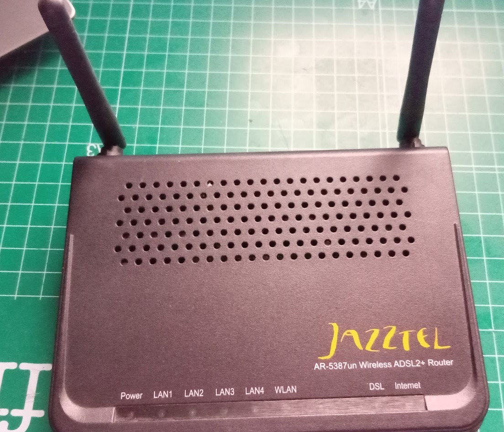
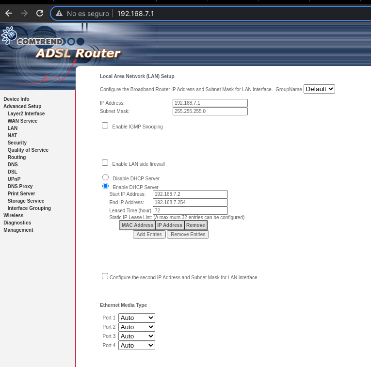
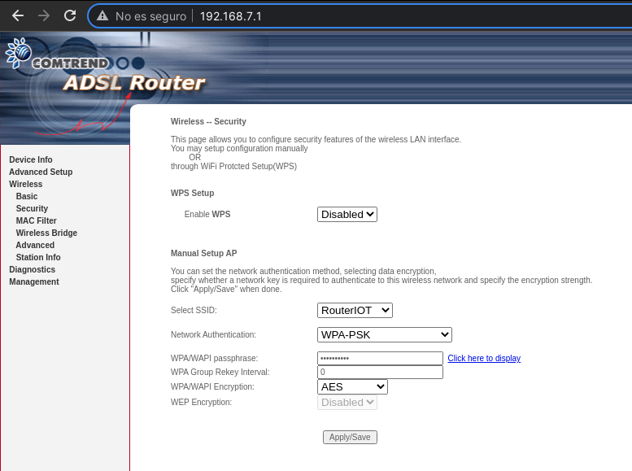
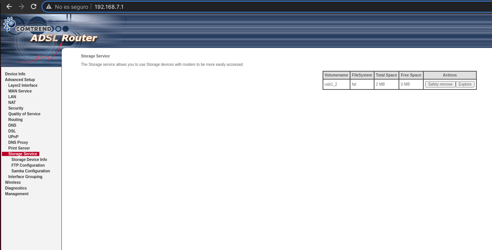

## Configuración de router para IOT

Dadas las limitaciones de las conexiones que solemos encontrar lo mejor es configurar un router para estas conexiones.

Puede servir un router doméstico que "tunearemos" y al que nos conectaremos con los dispositivos IOT y, para probar el funcionamiento, con otros dispositivos:

Configuraremos la red que usará el router, para ello establecemos la ip del router y la máscara de red. En la imagen vemos como hemos establecido la IP del router con la IP 192.168.7.1, y al poner la máscara como 255.255.255.0 haremos que las ips de los dispositivos sean del rango 192.168.1.7.x

También activamos el servidor DHCP para que todos los dispositivos que se conecten obtengan una IP del rango y no saturemos el otro router.

Establecemos las características de la red wifi que usaremos y que necesitaremos para configurar nuestros dispositivos:

Algunos router nos permiten compartir un disco USB  

