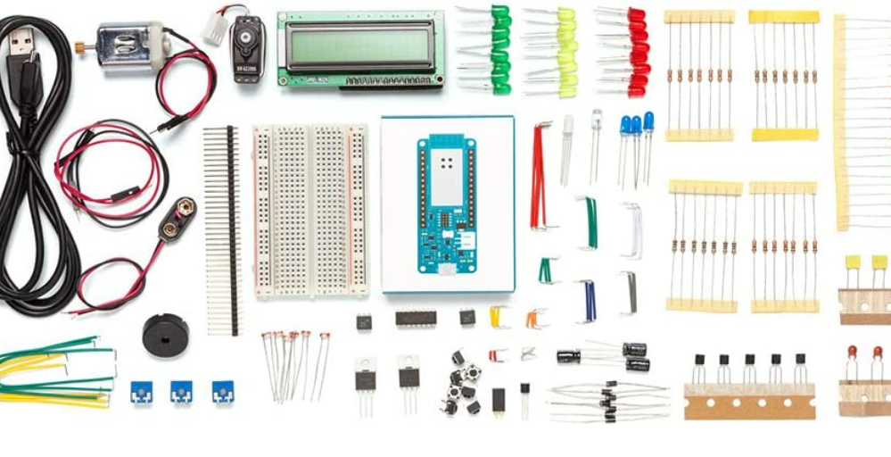

[LORAWAN INDOOR GATEWAY LIG 16](https://www.google.com/search?q=LORAWAN+INDOOR+GATEWAY+LIG+16&oq=LORAWAN+INDOOR+GATEWAY+LIG+16&aqs=chrome..69i57j33i10i160l2.354j0j7&sourceid=chrome&ie=UTF-8)

[Arduino MKR WAN1300](https://www.google.com/search?q=Arduino+MKR+WAN1300&sxsrf=ALiCzsYnDZkArps-cRZS6_Lo81BtinnEhQ%3A1656149274157&ei=GtW2YtCLCZ2Exc8P49yHmAQ&ved=0ahUKEwjQgLnppMj4AhUdQvEDHWPuAUMQ4dUDCA8&uact=5&oq=Arduino+MKR+WAN1300&gs_lcp=Cgdnd3Mtd2l6EAMyBAgAEA0yBAgAEA0yBAgAEA0yBggAEB4QDTIGCAAQHhANMgYIABAeEA0yBggAEB4QDTIGCAAQHhANMgYIABAeEA0yBggAEB4QDToICAAQsAMQogQ6BwghEAoQoAFKBAhBGAFKBAhGGABQ1gNYyQdgugpoAXAAeACAAcgBiAHLBJIBBTAuMy4xmAEAoAEByAEFwAEB&sclient=gws-wiz)  [Documentación](https://docs.arduino.cc/hardware/mkr-wan-1300)

## [KIT Arduino IoT MKR1000](https://www.amazon.es/Arduino-GKX00006-MKR-IoT-Bundle/dp/B076VPGKNK)

[Documentación MKR1000](https://docs.arduino.cc/hardware/mkr-1000-wifi) [Getting started](https://www.hackster.io/charifmahmoudi/arduino-mkr1000-getting-started-08bb4a) [Doc bricogeek](https://tienda.bricogeek.com/arduino-mkr/1028-arduino-mkr1000-wifi.html)

Cada paquete incluye: 
* 1 placa Arduino MKR1000, con cabezal soldado. 
* 1 cable micro USB
* 1 placa de 400 puntos 
* 70 cables de puente de núcleo sólido
* 1 broche de batería de 9 V
* 1 cable de puente trenzado  
* 6 LDR
* 3 potenciómetros (10 kilohm), 
* 10 botones, 
* 1 sensor de temperatura (TMP36)
* 1 sensor de inclinación, 
* 1 LCD alfanumérico (1 6 x 2 caracteres), 
* 1 blanco brillante
* 34 LED (1 blanco brillante, 1 RGB, 8 rojo, 8 verde, 8 amarillo, 3 azules)
* 1 pequeño motor CC (6/9 V)
* 1 pequeño servomotor
* 1 cápsula piezoeléctrica (PKM17EPP-4001-B0)
* 1 controlador de motor H-bridge (L293D) 
* 1 pulacopladores (4NE5)
* 2 MO. SFET transistorS (IRF520)
* 5 condensadores (100uF)
* 5 diodos (1N4007), 
* 3 ledes transparentes (R,G,B) 
* 1 tira macho (40 x 1), 
* 20 resistencias (220 ohm), 5 resistencias (560 ohm), 5 resistencias (1 kilohm), 5 resistencias (4,7 kilohm, 20 resistencias (10 kilohm), 5 resistencias (1 megohm), 5 resistencias (10 megohm). 

