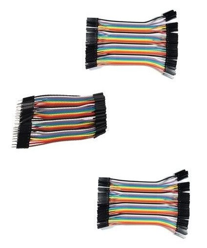

## Material para iniciación

[Sensor humedad de suelo](https://solectroshop.com/es/sensores-de-humedad/129-modulo-sensor-humedad-tierra-agua-suelo.html)

[WeMos D1 ESP32 R32 WROOM-32 WiFi y Bluetooth](https://solectroshop.com/es/modulos-wifi/1755-wemos-d1-esp32-r32-wroom-32-wifi-y-bluetooth.html)

[Cable micro-USB](https://solectroshop.com/es/cables-usb/1439-cable-usb-a-a-micro-usb-b-arduino-leonardo-due.html)

[Sensor atmosférico DHT11](https://solectroshop.com/es/sensores-de-humedad/894-modulo-dht11-sensor-de-temperatura-y-humedad.html)

[Relé de 5V](https://solectroshop.com/es/modulos-rele/281-modulo-rele-5v-10a-de-4-canales.html)

[Sensor de agua](https://solectroshop.com/es/sensores-de-nivel-de-fluido/853-modulo-sensor-nivel-de-agua-uno-mega-pic.html)

[Cables de conexión](https://solectroshop.com/es/cables-planos-y-jumpers/4757-kit-cables-hembra-macho-hembra-hembra-macho-macho-jumpers-dupont-10cm.html)

