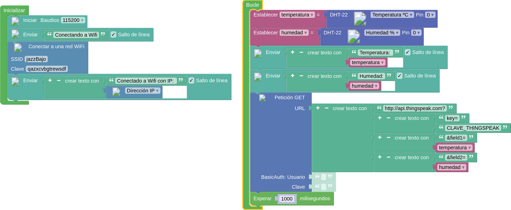
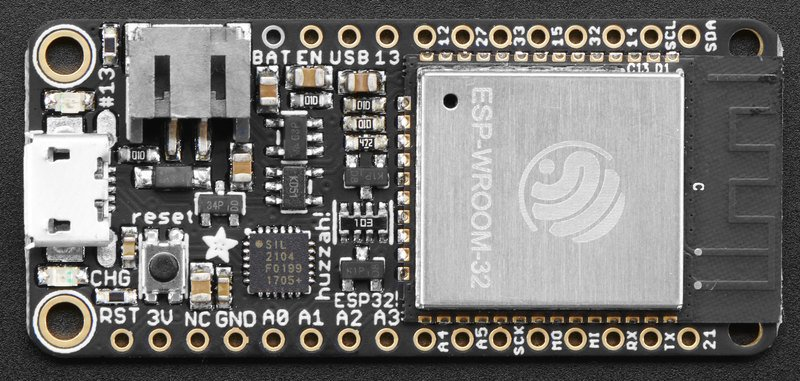
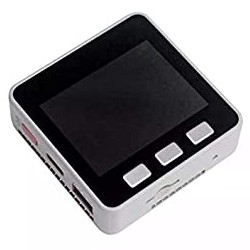
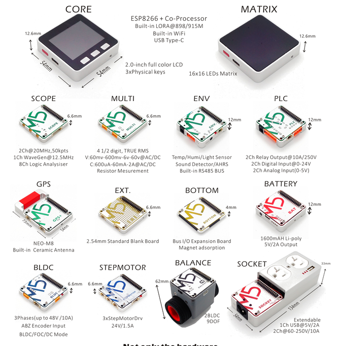
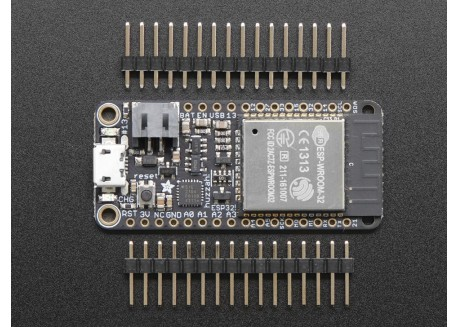
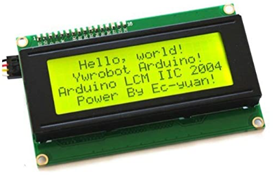
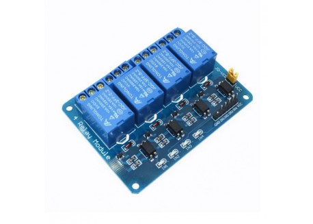
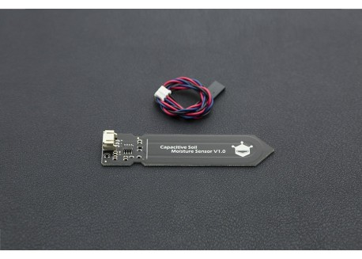
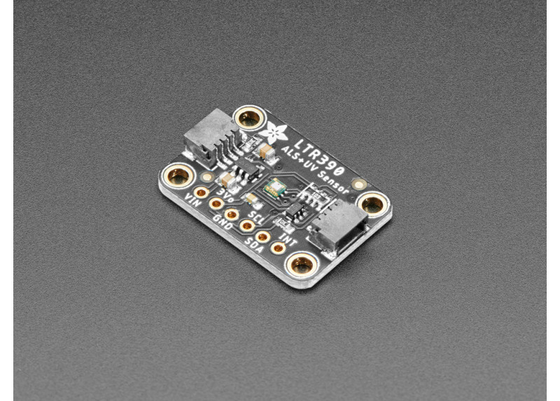
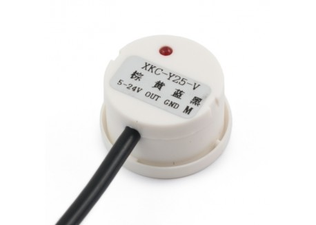

# Propuesta 1 - usando los equipos actuales

* Equipos Arduino MKR, algunos ya descatalogados y caros
* Muy poca variedad de sensores (Kit IOT)
* Programación con C++ (más compleja)

# Propuesta 2 - nuevos equipos

* Programación con bloques, sencilla pero potente (ejemplo de publicación de datos en la nube)

 
En todo momento podemos generar el código C++ a partir de los bloques

* Equipos ESP32 Feather: Wifi y bluetooth, cargador de batería lipo (20eu)

* Tanto la programación como el montaje son fácilmente trasladable a equipos profesionales que ya se pueden usar en campo: m5Stack (ESP32)

Existen multitud de escudos/shields que se conectan directamente a la base y que proporcionan control sobre motores, relés, sensores, ....

## Contenidos

* Programación con bloques
* IOT. Protocolos
* Publicación en plataformas en la nube
* Desarrollo de proyectos IOT

## Proyectos a realizar

Todos con recogida de datos en local y publicación y control remoto vía internet

* Estación meteorológica
* Sistema riego (a falta de electroválvulas o bomba)
* Control de llenado y vaciado de depósitos
* Instalación domótica sencilla
* Sistemas automáticos de iluminación

## Equipo propuesto

[Adafruit HUZZAH32 - ESP32 ](https://tienda.bricogeek.com/placas-adafruit-feather/1108-adafruit-huzzah32-esp32-feather.html)

[Batería Lipo](https://tienda.bricogeek.com/baterias-lipo/342-bateria-lipo-900-mah.html)

[Pantalla LCD con conexión I2C de 4x20](https://www.amazon.es/Display-Adapter-Raspberry-pantalla-proyecci%C3%B3n/dp/B07XT7LN61/)

[Sensor de temperatura, humedad y presión BME280](https://tienda.bricogeek.com/sensores-temperatura/1116-sensor-de-temperatura-humedad-y-presion-bme280.html)

[Módulo de relés](https://tienda.bricogeek.com/interruptores/886-modulo-4-reles-5v.html)

[Sensor de humedad de suelo](https://tienda.bricogeek.com/sensores-humedad/1075-sensor-de-humedad-del-suelo-anticorrosion.html)

[Sensor de luz UV](https://tienda.bricogeek.com/luz-infrarrojos/1658-sensor-de-luz-uv-ltr390.html)

[Sensor de nivel de líquido (sin contacto)](https://tienda.bricogeek.com/sensores-capacitivos/1235-sensor-de-nivel-de-liquido-xkc-y25-t12v.html)

