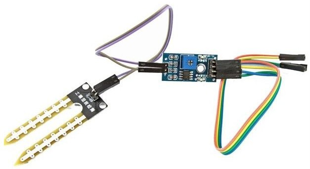
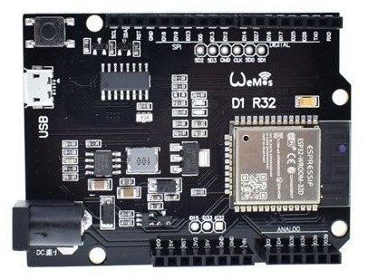
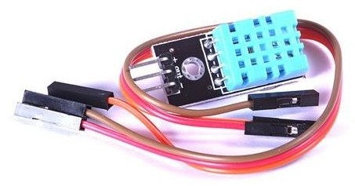
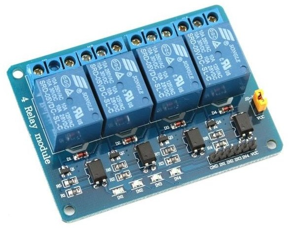
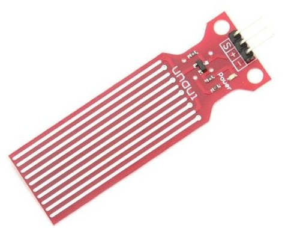
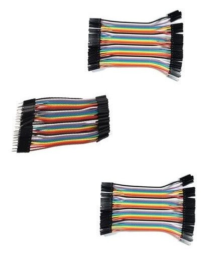

# Curso de iniciación a IOT en la agricultura

19 al 23 de Septiembre

25-30 horas 

## Descripción

Las tecnología de IOT están cada vez más presentes a nuestro alrededor, desde las pulseras de ejercicio hasta los sistems domóticos que tenemos en nuestras casas.

La integración de los sistemas IOT en el entorno profesional e industrial no sólo nos permite automatizar de una forma sencilla procesos que antes se hacían manualmente, sino que podemos medir y valorar la ganancia que se optiene para así optimizar el desempeño del sistema.

A día de hoy podemos encontrar sistemas IOT a un precio bajo, y además, su naturaleza opensouce nos permite adaptarlos totalmente a nuestras necesidades, programándolos y añadiendo aquellos componentes que realmente necesitamos.

## Desarrollo del curso

Comenzaremos usando la placa ESP32 más sencilla de programar: 

1. Programación con Bloques
2. Introducción a la electŕonica y montajes sencillos
3. Proyectos de control local:
    * Iluminación automática
    * Ventilación 
    * Riego centralizado  
    * Estación de bombeo
4. Conexión y control de sistemas remotos   
    * Riego distribuido
    * Control de acceso y puertas    
5. Programación con código

Posteriormente pasaremos a usar las placas arduino MKR más complejas de programar

6. Programación con código
7. Integración de proyectos

# Contenidos

* Introducción al IOT y su aplicación en la agricultura
* Introducción a los montajes electrónicos de IOT
* Sensores y actuadores más frecuentes
* Programación de sistemas IOT con bloques (arduinoblocks.com)
* Uso de simuladores y herramientas de clase
* Montaje de proyectos sencillos de IOT
* Uso de plataformas en la nube para IOT
* Montaje de sistema en local para recogida de datos

# Objetivos

* Entender el concepto de IOT
* Aplicar IOT en la agricultura
* Conocer la arquitectura de un sistema de IOT
* Saber implementar un sistema de IOT
* Conocer las base de la programación y configuación de un sistema IOT
* Mantener en buen funcionamiento un sistema IOT
* Conocer los problemas más frecuentes y cómo resolverlos

## Material a comprar

## Material para iniciación

[Sensor humedad de suelo](https://solectroshop.com/es/sensores-de-humedad/129-modulo-sensor-humedad-tierra-agua-suelo.html)

[WeMos D1 ESP32 R32 WROOM-32 WiFi y Bluetooth](https://solectroshop.com/es/modulos-wifi/1755-wemos-d1-esp32-r32-wroom-32-wifi-y-bluetooth.html)

[Sensor atmosférico DHT11](https://solectroshop.com/es/sensores-de-humedad/894-modulo-dht11-sensor-de-temperatura-y-humedad.html)

[Relé de 5V](https://solectroshop.com/es/modulos-rele/281-modulo-rele-5v-10a-de-4-canales.html)

[Sensor de agua](https://solectroshop.com/es/sensores-de-nivel-de-fluido/853-modulo-sensor-nivel-de-agua-uno-mega-pic.html)

[Cables de conexión](https://solectroshop.com/es/cables-planos-y-jumpers/4757-kit-cables-hembra-macho-hembra-hembra-macho-macho-jumpers-dupont-10cm.html)

# IOT agricultura

## Introducción al IOT
* Qué es IOT
* Aplicaciones
    * Agricultura
    * Ganadería
    * Automatización
    * Optimización
    * Movilidad
    * Detección de incendios
    * Redes de sensores
* Arquitectura
    * Unidades remotas + servidor
    * Procesador + sensores + actuadores + alimentación + redes de comunicaciones + servidor
    * Redes
        * Globales: GPS y Lora
        * Locales: wifi y bluetooth

## Introducción electrónica
* Montajes

### Sensores
* Tipos
    * Atmosféricos: temperatura humedad presión
    * Gaseosos: calidad del aire CO2 CO metano partículas 
    * Humedad de suelo
    * Nivel de líquidos
* Calidades
* Uso y programación

### Actuadores: 
* Motores: 
    * Paso a paso
    * Servos
    * DC
    * Bombas
* Relés
* Electroválvulas
* Control digital y analógico

### Alimentación
* Baterías
* Solar
* Otras fuentes

## Planificación

## Mantenimiento

## Familias de IOT
* Arduino
* Esp32
* Raspberry

## Introducción a la programación

* Entornos de programación
    * Bloques
    * Código
* Comparación y Ventajas

## Proyectos:
* Iluminación automática
* Ventilación 
* Riego centralizado
* Riego distribuido
* Control de acceso y puertas
* Estación de bombeo
* Sistemas locales y remotos

## Simuladores
* Tinkercad
* Woki
* Herramientas para el aula

## Servicios en la nube
* Local vs comercial

### Servicios comerciales
* Thingspeak
* Adafruit IO
* Arduino IO

### Servidor local
* Instalación de servidor local
* Gestión de servidor local

#### Distribuciones domóticas
* Home assistant

### Procesamiento de datos
* Graficado de datos
* Extracción y explotación de datos
* Grafana

## Redes y comunicaciones
* Arquitectura cliente/servidor
* Introducción a las Redes
* Configuración de redes y routers
* Practicas de redes en el aula
* Detección de errores

## Mantenimiento
* Mantenimiento de redes
* Mantenimiento de estaciones
* Detección de problemas

## Seguridad: 
* Seguridad en las comunicaciones
* Seguridad de los datos

## Equipos industriales y semi-industriales
* Sonoff
* M5stack
* Shelly
* Integración en instalaciones ya hechas
